# 第三章 设计

## 3.1 架构设计

### 3.1.1 服务拆分与注册中心
本系统采用分布式微服务架构设计，系统的核心功能模块化为八大微服务：数据字典服务、医院管理服务、用户服务、短信服务（依托阿里云SMS）、对象存储服务（利用阿里云OSS）、订单服务、定时任务服务以及统计分析服务。
所有微服务均注册至Nacos注册中心，通过服务发现机制实现动态管理和通信。

### 3.1.2 微服务网关设计
使用统一的网关作为系统对外服务的入口，负责路由转发、权限控制、限流降级等非功能性需求，保证系统的稳定性和安全性。
医院通过系统提供的SDK调用网关，进而访问各个微服务进行数据的同步与交互。

### 3.1.3 持久化存储
关系型数据存储：使用MySQL存储系统中涉及的关系性强、事务性要求高的数据，例如用户信息、订单详情等。
文档型数据存储：选用MongoDB存放适合文档模型的数据，比如医院信息、科室信息等结构不固定的数据。
缓存服务：借助Redis作为缓存中间件，提高系统性能，降低数据库压力，存储高频访问的数据如用户session、订单状态等。

### 3.1.4 异步处理与消息队列
使用RabbitMQ作为消息队列，实现系统的异步解耦，例如订单状态变更、消息推送等场景，保证系统的高可用性和扩展性。

### 3.1.5 前端技术栈
后台管理系统采用Vue.js框架开发，实现丰富的数据展示和管理功能，满足后台管理人员对系统各项功能的精细化操作需求。
前台门户采用Nuxt.js构建，结合Vue.js的SSR特性优化SEO效果和首屏加载速度，为用户提供流畅的浏览和交互体验。

### 3.1.6 系统架构图
综上所述，本系统通过合理的微服务架构设计、多样化的数据库支持、高效的消息队列以及现代化的前端框架，构建了一个高性能、高可用、易于维护和扩展的预约挂号统一平台。架构图如下：
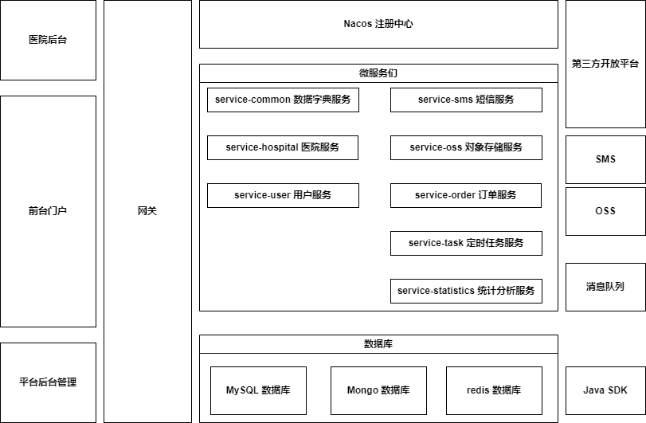

## 3.2 模块总览
整个系统的模块总览图，通常包括了所有核心模块以及它们之间的依赖和交互方式，直观地展示了系统的不同组成部分及其相互关系。下面几个小节将以UML类图的形式展示对系统的各个模块进行详细的设计和实现。

## 3.3 数据模型
系统所使用的数据模型设计，涵盖了各个模块的数据库实体、值对象等。

### 3.3.1 数据字典
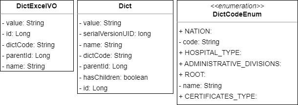

### 3.3.2 医院
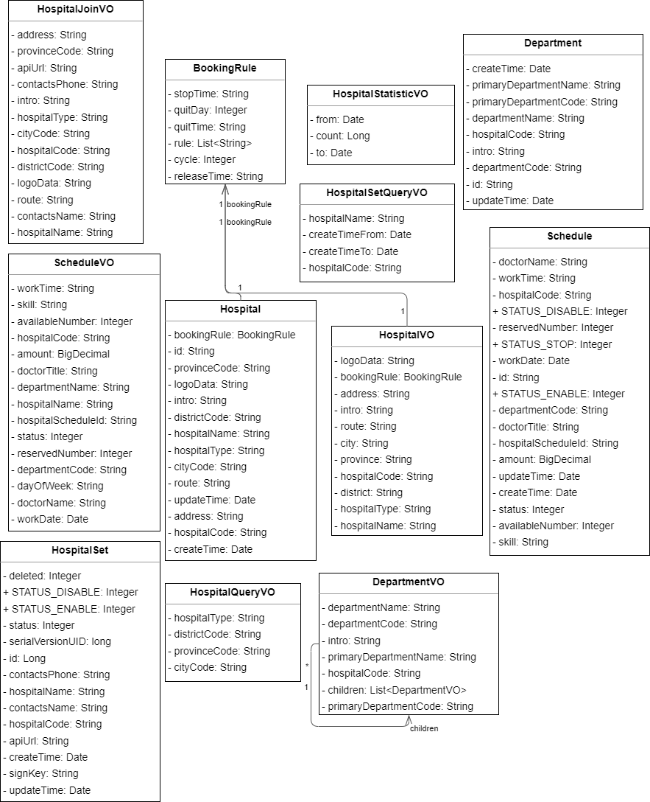

### 3.3.3 用户
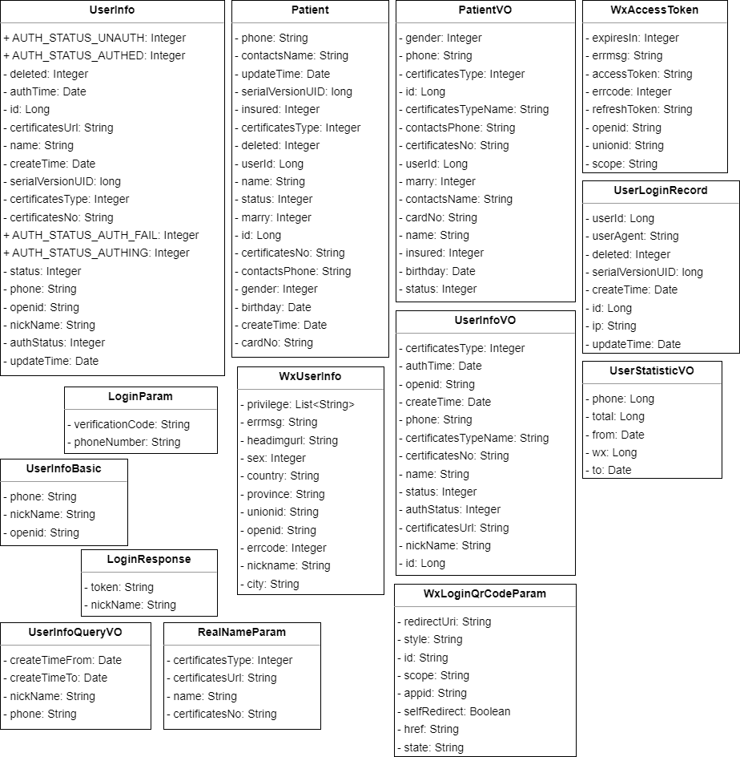

### 3.3.4 订单
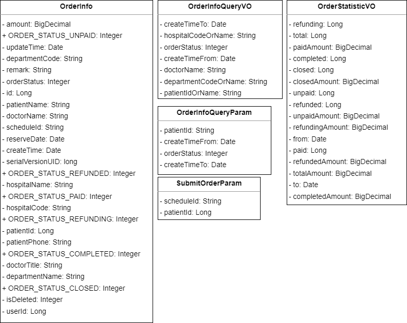

### 3.3.5 其他

## 3.4 工具类

### 3.4.1 通用工具类
系统中开发的一系列通用工具类，这些类封装了常见的、跨模块的实用功能，例如日期时间处理、字符串操作、加密解密、随机数处理、文件操作等。
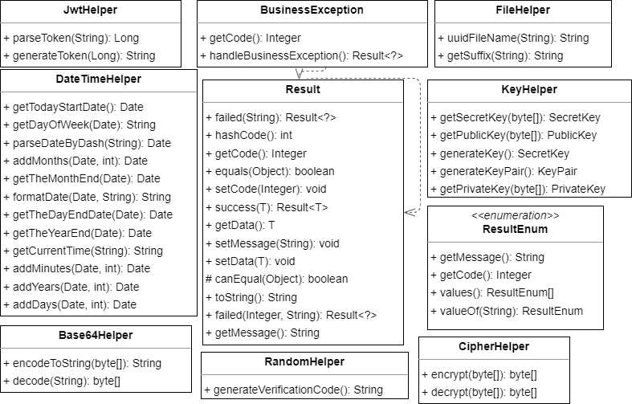

### 3.4.2 服务工具类
专述服务相关的工具类，包含用于微服务间通信、请求响应处理、异常处理、API调用封装等功能的类，旨在简化服务层代码的复杂性，提高复用性和可维护性。
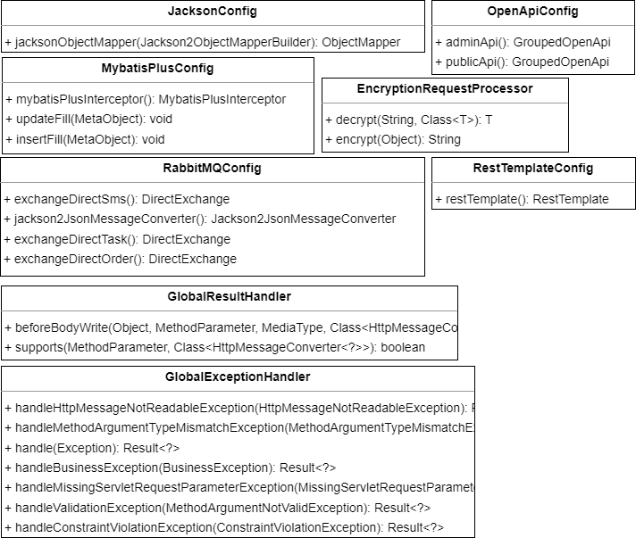

## 3.5 网关
系统对外暴露的API网关设计，包括其路由配置、身份验证、授权等方面的功能设计与实现，它是外部请求进入系统内部各微服务前的第一道屏障。
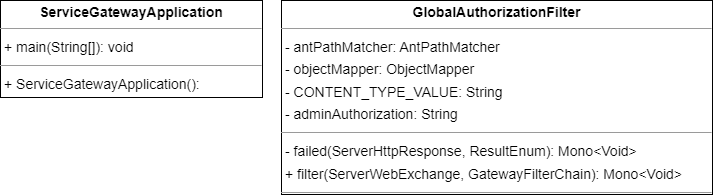

## 3.6 微服务

### 3.6.1 数据字典
用于管理系统的元数据，如枚举值、静态配置项等，并确保数据的一致性和准确性。
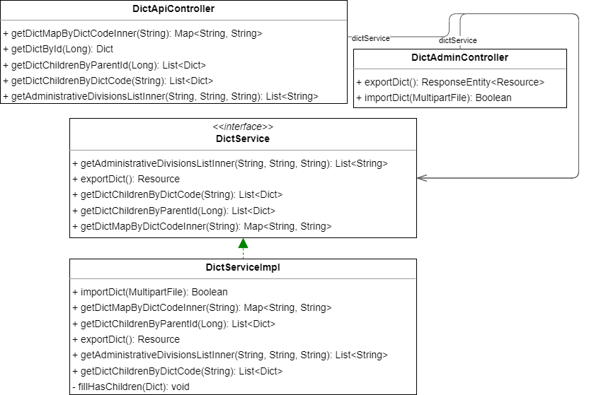

### 3.6.2 医院
系统的核心微服务，提供了与医院业务逻辑相关的微服务设计，包括但不限于医院信息管理、科室管理、医生排班、挂号预约等功能。
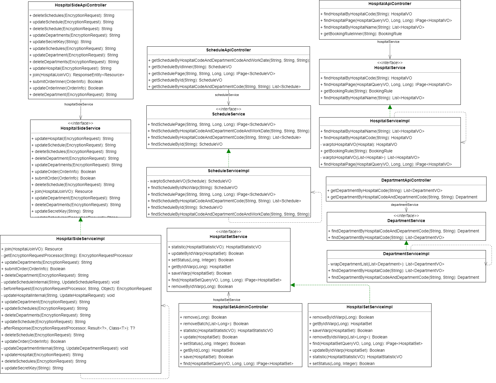

### 3.6.3 用户
用户账号生命周期管理，包括用户注册、登录认证、就诊人信息的管理。
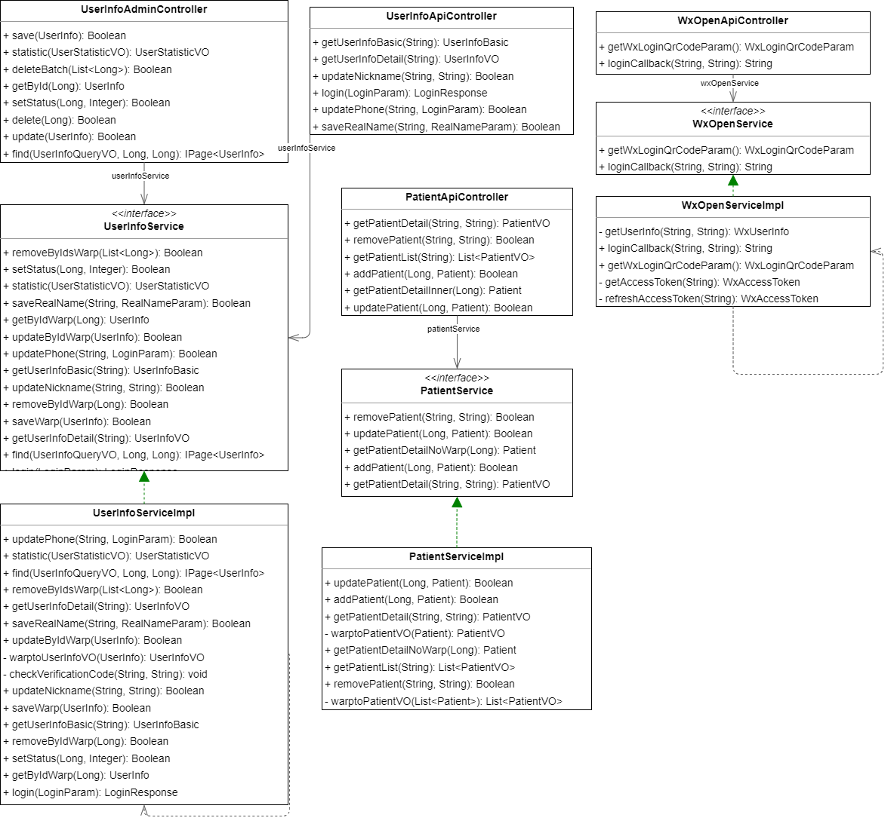

### 3.6.4 短信
针对短信发送功能设计的微服务，集成阿里云SMS服务，处理验证码发送、通知消息推送等业务场景。
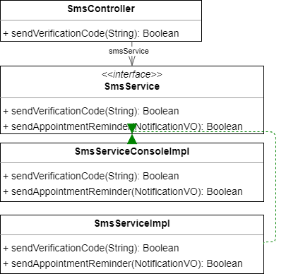

### 3.6.5 对象存储
用于用户认证信息、文件的存储的微服务，通过阿里云OSS提供文件上传下载、存储桶管理等功能。
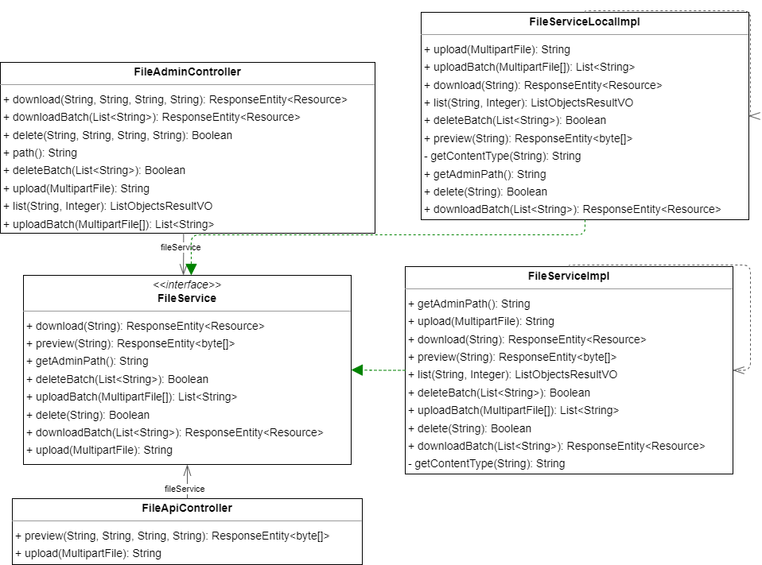

### 3.6.6 订单
处理预约挂号、支付、退订等一系列与订单生命周期相关的业务流程。
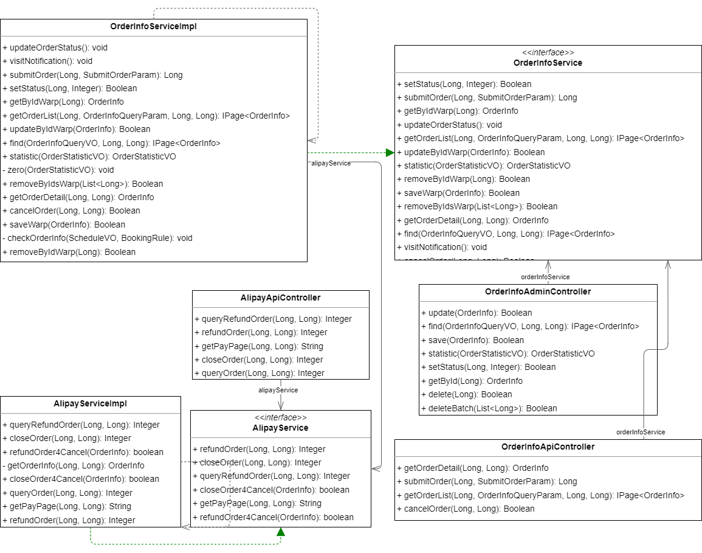

### 3.6.7 定时任务
负责执行周期性任务，如通知用户订单状态更新、就诊通知、排班信息更新等后台作业。
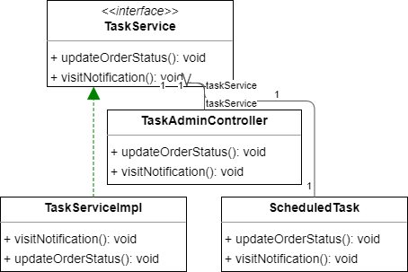

### 3.6.8 统计分析
对注册用户、接入医院和挂号订单进行数据聚合以生成报表等统计分析功能。

## 3.7 微服务客户端
系统内部各微服务之间交互时所使用的客户端设计，包括微服务的注册发现与调用（服务间通信）
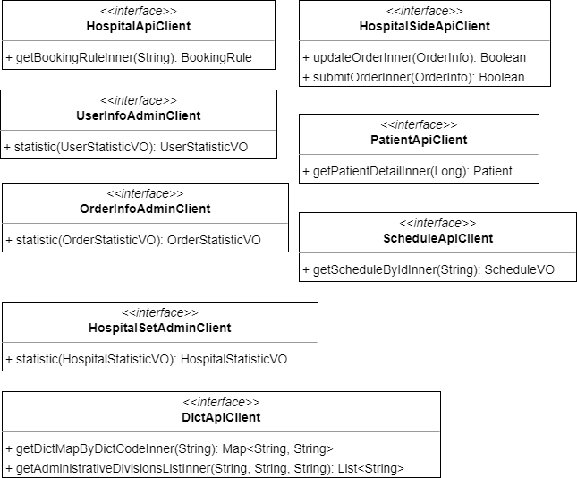

## 3.8 SDK
为医院侧提供的SDK设计，该SDK包含了与系统进行交互所需的接口、认证机制、错误处理等内容，方便医院便捷地整合并对接到系统中。
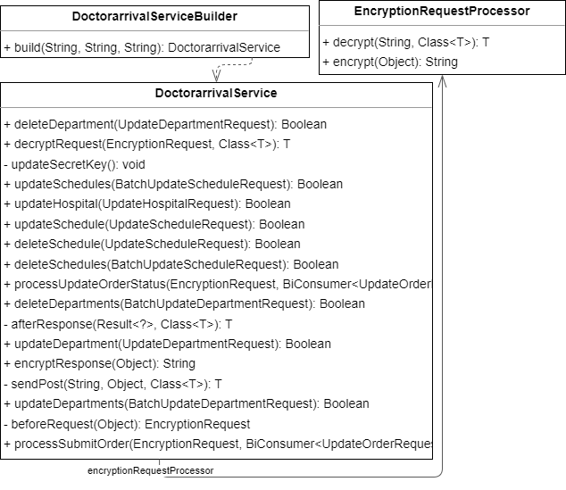

## 3.9 数据库设计
根据上面的需求分析和系统架构、模块设计，本系统关系型数据库部分的表结构设计如下：
[common.db](../数据库设计/doctorarrival_common.docx)
[hospital.db](../数据库设计/doctorarrival_hospital.docx)
[order.db](../数据库设计/doctorarrival_order.docx)
[user.db](../数据库设计/doctorarrival_user.docx)

## 3.10 技术选型
| 后端开发     | 技术选型               | 说明                                                                             |
| ------------ | ---------------------- | -------------------------------------------------------------------------------- |
| 基础框架     | Spring Boot            | Java企业级应用程序的快速开发框架，具有简洁的编码风格和强大的自动配置能力。       |
| 微服务框架   | Spring Cloud + Alibaba | 提供分布式系统开发的一整套解决方案，阿里巴巴开源实现进一步增强了微服务治理功能。 |
| 程序构建工具 | Maven                  | 用于Java项目的构建与依赖管理，简化构建过程和版本控制。                           |
| 持久层框架   | Mybatis-Plus           | 基于MyBatis扩展的持久层框架，简化了CRUD操作，提高了开发效率。                    |

| 数据存储       | 技术选型 | 说明                                                                                    |
| -------------- | -------- | --------------------------------------------------------------------------------------- |
| 关系型数据库   | MySQL    | 开源、广泛应用的关系型数据库，用于存储结构化、事务性强的数据，如用户信息、订单详情等。  |
| 非关系型数据库 | MongoDB  | 用于存储JSON-like文档，适合结构灵活、查询复杂的数据，如医院信息、科室信息、排班信息等。 |
| 缓存系统       | Redis    | 高性能内存键值数据库，用于存储热点数据、会话信息等，提高系统响应速度。                  |
| 消息中间件     | RabbitMQ | 实现系统间的异步解耦，处理如订单状态通知、消息推送等消息传递任务。                      |

| 分布式服务组件 | 技术选型       | 说明                                                             |
| -------------- | -------------- | ---------------------------------------------------------------- |
| 注册与配置中心 | Nacos          | 用于服务的注册发现、配置管理，提供服务治理和配置变更推送功能。   |
| 认证机制       | JWT            | JSON Web Tokens，用于无状态、安全的用户认证和授权。              |
| API 网关       | Spring Gateway | 提供统一的路由、过滤器和熔断机制，实现服务的统一入口和权限控制。 |
| 负载均衡       | Nginx          | 高性能的反向代理服务器和负载均衡器，实现流量分配和故障转移。     |

| 第三方服务 | 技术选型   | 说明                                                           |
| ---------- | ---------- | -------------------------------------------------------------- |
| 短信服务   | 阿里云短信 | 提供可靠的短信验证码发送、通知消息推送服务。                   |
| 文件存储   | 阿里云OSS  | 为企业和个人开发者提供海量、安全、低成本、高可靠的云存储服务。 |

| 前端开发     | 技术选型         | 说明                                                               |
| ------------ | ---------------- | ------------------------------------------------------------------ |
| 打包工具     | Vite             | 构建工具，提供更快的热更新速度和更优的开发体验。                   |
| 基础JS框架   | Vue.js、Nuxt.js  | Vue.js用于构建用户界面，Nuxt.js则为Vue.js提供服务端渲染(SSR)支持。 |
| 路由管理     | Vue Router       | Vue.js官方路由库，用于管理SPA应用的路由导航。                      |
| 状态管理     | Vuex             | Vue.js的状态管理模式，集中管理组件的状态数据。                     |
| UI组件库     | Element-Puls     | 基于Vue.js的丰富UI组件库，用于快速构建页面。                       |
| 页面模板     | vue-admin-box    | 基于Vue.js的后台管理系统模板，加快界面搭建进程。                   |
| 网络请求     | axios            | 基于Promise的HTTP客户端，用于前后端数据交互。                      |
| 图表库       | echarts          | 功能丰富的JavaScript图表库，用于数据可视化展示。                   |
| CSS预处理器  | Sass             | 提高CSS编写效率，支持变量、嵌套、混合等功能。                      |
| 代码规范检查 | ESLint、Prettier | 自动化检测代码风格与格式，提升代码质量和一致性。                   |
