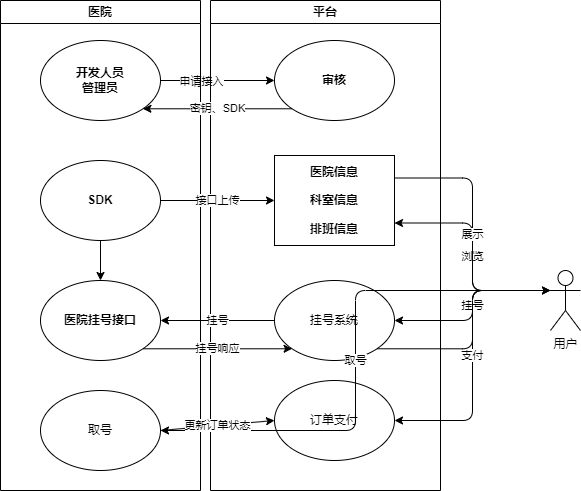

# 2 需求分析

## 2.1 后台管理
<!--
1、首页：展示注册用户数、接入医院数、订单数和订单金额

2、数据管理
展示行政区划、医院等级、证件类型、学历、民族并提供导入、导出功能

3、医院管理
展示医院设置列表、提供医院设置（api基础路径、密钥、联系人）增删改，启用禁用功能

4、用户管理
提供注册用户列表供查看、增删改，启用禁用功能

5、消息管理
查看消息列表、提供消息推送功能

6、对象存储
查看认证信息/图片等数据的存储情况，提供增删功能

7、订单管理
查看订单列表、提供订单状态修改功能

8、定时任务
手动执行发送就诊提醒、更新订单状态等定时任务

9、统计分析
提供注册用户数、接入医院数、订单数和订单金额的统计分析以图表形式展示
-->

### 2.1.1 首页
设计一个仪表板用于数据概览，实时显示关键运营指标，包括注册用户总数、接入的医院总数、累计订单数量以及累计订单金额。

### 2.1.2 数据字典
使用一个树形表格实现对行政区划、医院等级、证件类型、学历和民族等基础数据的维护，支持批量导入与导出操作。

### 2.1.3 医院管理
构建一个可编辑的医院接入信息展示列表，允许管理员进行新增、删除、修改医院相关信息，如API基础路径、密钥、联系人信息，并支持启用和禁用医院账号的功能。

### 2.1.4 用户管理
该模块提供用户账户列表的浏览、搜索、新增、编辑和删除功能，同时具备用户状态（启用/禁用）的调整能力。

### 2.1.5 消息管理
支持查看所有已发送和待发送的消息记录，同时提供向用户或医院发送各类消息的通知功能。

### 2.1.6 对象存储
用于查看、管理和操作用户认证资料及其他相关图片等文件的存储情况，支持文件的预览、上传、下载和删除操作。

### 2.1.7 订单管理
提供订单列表的查询、筛选、详情展示，以及订单状态更改的操作权限。

### 2.1.8 定时任务
提供能够手动触发诸如发送就诊提醒、自动更新订单状态等定时任务的功能。

### 2.1.9 统计分析
通过可视化图表展现注册用户数、接入医院数、订单数和订单金额的趋势变化和统计分布。

## 2.2 前台门户
<!--
医院部分
1、首页数据
（1）医院列表、可按照医院等级、地区、医院名称进行筛选
（2）展示常见科室和平台公告

2、医院详情
（1）医院科室
（2）医院详情
（3）预约须知
（4）停诊信息
（5）订单查询及取消

3、门诊排班
（1）每日放号数、剩余号数
（2）医生排班信息、挂号费

4、挂号预约
（1）选择排班和就诊人
（2）确认挂号信息
（3）生成预约挂号订单
（4）挂号订单支付（支付宝）
（5）取消预约订单

用户部分
1、用户登录功能
（1）手机号登录（发送短信验证码）
（2）微信扫码登录

2、用户实名认证
（1）填写个人信息
（2）上传证件照片
（3）提交审核

3、就诊人管理
（1）列表、添加、详情、删除

4、订单管理
（1）订单列表、订单详情
（2）订单支付（支付宝）
（3）订单取消

5、讨论区

其他
1、消息推送
（1）订单状态变更提醒
（2）就诊、停诊通知
（3）平台公告

2、医院接入
（1）医院接入申请
（2）审核发放密钥、SDK
-->

### 2.2.1 医院部分

- 医院检索模块：提供多维度筛选条件，展示医院列表及其等级、地域、名称等信息，同时展示常见科室列表和平台公告。

- 医院详情页面：包含科室介绍、医院详细信息、预约须知、停诊通知等内容，并提供订单查询和取消功能。

- 门诊排班查询：展示每日各科室放号数量、剩余号源信息，以及医生具体排班时间和挂号费用。

- 挂号预约流程：用户可以按照实际需求选择排班、填写就诊人信息，完成预约挂号后生成订单，支持支付宝支付挂号费，并可在线取消预约订单。

### 2.2.2 用户部分

- 用户认证与登录：支持手机号码验证登录（短信验证码方式）和微信扫码快捷登录。

- 实名认证功能：用户需要填写个人信息并通过上传证件照片进行实名认证，等待后台审核。

- 就诊人信息管理：用户可以管理多个就诊人的基本信息，包括查看、添加、编辑和删除就诊人信息。

- 个人订单管理：用户能查看自己的订单列表和订单详情，进行订单支付（支付宝）、订单详情查询以及取消订单操作。

- 讨论区功能：建立用户交流社区，方便用户分享就医体验、获取健康咨询等。

### 2.2.3 其他

- 消息通知机制：系统在订单状态变更、就诊时间变动、停诊通知和平台公告发布时，应及时推送给相关用户或医院。

- 医院接入流程：提供医院自助接入申请功能，后台审核通过后发放密钥和SDK，以便新医院快速加入平台。

## 2.3 业务流程

### 2.3.1 医院接入
医院通过前端门户提交接入申请，提供必要的基础信息，包括但不限于医院名称、地理位置、级别、联系方式等，并设定API基础路径。平台后台收到接入申请后，由管理员进行审核。审核内容包括确认医院资质和所提供信息的真实性与完整性。审核通过后，后台管理系统自动生成密钥和配套的SDK，并将这些信息通过安全渠道发放给医院方。医院技术人员利用发放的SDK和密钥对接到平台，开始推送和更新医院的基础信息、科室信息以及医生排班表等相关数据至平台服务器。

### 2.3.2 数据同步与展示交互
医院通过授权的SDK接口成功将最新的医院基本信息、科室结构、医生专业介绍、实时的排班计划等关键数据上传至平台。平台端接收到这些数据后，运用高效的后台处理机制进行整合、验证和储存，并确保在前台门户页面即时更新展示，使用户能够随时查看并了解到所有已接入医院的详尽情况，包括但不限于医院等级认证、各科室的功能划分及其特色服务，以及各个医生的专业特长和当前可预约时段。

### 2.3.3 用户交互与预约流程
当用户访问平台时，可根据自己的需求对不同医院、科室和医生进行多维度筛选和比较，进而选定心仪的目标进行预约挂号。用户可在规定的预约时间段内自由选择合适的医生和时间，并在平台上完成挂号操作。系统会在用户下单瞬间基于预定规则创建订单，记录下预约详情，包括用户身份信息、就诊时间和医生信息等核心要素。

### 2.3.4 支付与订单管理
预约完成后，用户可以通过集成的安全支付通道完成在线支付，支持多种支付方式，如银行卡、第三方支付平台等。支付成功后，订单状态将被更新为已付款，并发送确认短信或邮件通知用户。此外，平台还会保留完整的电子账单供用户随时查阅。

### 2.3.5 订单变更与通知机制
在整个医疗服务过程中，平台保持与医院系统的紧密联动，定期同步医院方面的最新信息变化，如医生排班调整、科室临时关闭等。同时，医院亦可通过SDK主动推送更新信息至平台，共同确保用户所见信息的时效性和准确性。针对任何订单状态的更改，无论是用户发起的预约取消、改签请求，还是由于医院原因导致的就诊时间变动、临时停诊通知等情况，平台均能迅速响应并通过消息通知模块及时告知用户，以减少因信息滞后带来的不便。

### 2.3.6 现场服务与订单查询
到达就诊日，用户依据系统内的提示完成取号操作，正式进入诊疗流程。同时，用户不仅可以在就诊当天查询其预约订单的状态，还能够在任意时段登录平台查询历史订单记录，便于了解个人就诊历史和后续跟进事宜。通过这种闭环式的全流程管理，平台致力于为用户提供便捷、透明且高效的一站式医疗服务体验。

