# 第四章 实现

## 4.1 开发环境
| 环境组件 | 版本信息 |
| -------- | -------- |
| JDK      | 21.0.1   |
| Node.js  | 20.10.0  |
| Nacos    | 2.3.0    |
| MySQL    | 8.2.0    |
| MongoDB  | 6.0.12   |
| Redis    | 7.2.3    |
| RabbitMQ | 3.12     |

<!-- 对每个接口进行描述？ -->
## 4.2 数据字典

### 4.2.1 导入数据字典
- 接口路径：POST /admin/common/dict/import
- 接口描述：接收并解析上传的文件（通常是Excel格式），用于导入系统中的数据字典项。要求上传的文件不能为空，成功导入则返回true，否则可能抛出异常或返回false。
- 序列图：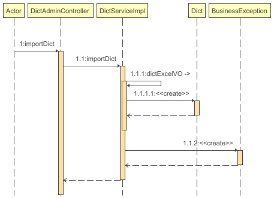

### 4.2.2 导出数据字典
- 接口路径：POST /admin/common/dict/export
- 接口描述：导出系统中现有的全部数据字典项至Excel文件。响应体是一个资源实体(Resource)，其内容类型为二进制流(application/octet-stream)，并自动设置了HTTP头以便浏览器识别并下载文件，文件名为'dict.xlsx'。
- 序列图：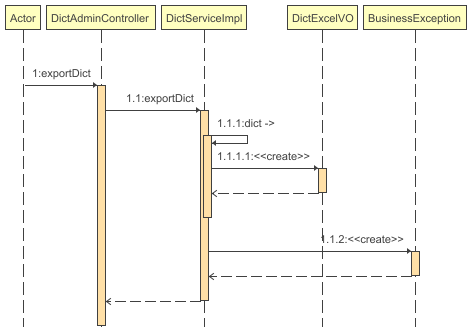

### 4.2.3 通过ID获取项
- 接口路径：GET /api/common/dict/id/{id}
- 接口描述：根据传入的数据字典ID（最小值为1）获取对应的字典项信息。
- 序列图：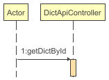

### 4.2.4 通过父项ID获取子项
- 接口路径：GET /api/common/dict/children/id/{parentId}
- 接口描述：根据传入的父级数据字典ID（最小值为1）获取其所有的子级字典项信息。
- 序列图：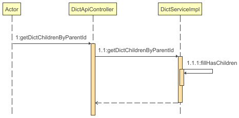

### 4.2.5 通过字典编码获取子项
- 接口路径：GET /api/common/dict/children/code/{dictCode}
- 接口描述：根据传入的数据字典编码获取对应的子级字典项信息。
- 序列图：

### 4.2.6 通过字典编码获取子项以Map形式返回
- 接口路径：GET /api/common/dict/inner/map/code/{dictCode}
- 接口描述：根据传入的数据字典编码，以键值对的形式返回对应的子级字典项信息集合。
- 序列图：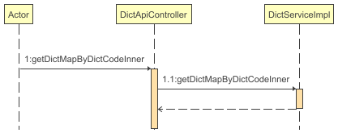

### 4.2.7 通过省市区编码获取省市区名称
- 接口路径：GET /api/common/dict/inner/administrative/divisions/list
- 接口描述：根据输入的省、市、区编码，返回对应的省市区名称列表。
- 序列图：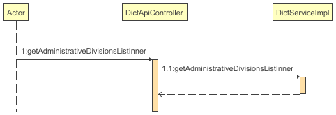

## 4.3 医院

### 4.3.1 新增医院设置
- 接口路径：POST /admin/hospital/set/save
- 接口描述：接收一个非空的HospitalSet对象作为新增数据，成功保存则返回true。
- 序列图：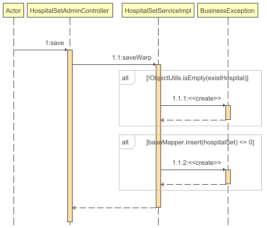

### 4.3.2 修改医院设置
- 接口路径：PUT /admin/hospital/set/update
- 接口描述：接收一个非空的HospitalSet对象作为更新数据，根据其ID进行更新操作，成功更新则返回true。
- 序列图：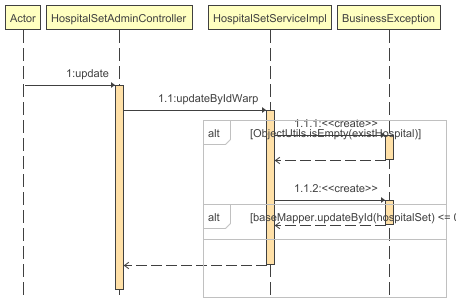

### 4.3.3 删除医院设置
- 接口路径：DELETE /admin/hospital/set/remove/id/{id}
- 接口描述：根据传入的ID（最小值为1）删除对应的医院设置，删除成功则返回true。
- 序列图：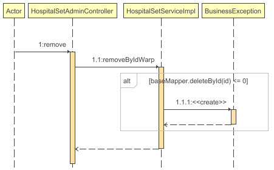

### 4.3.4 批量删除医院设置
- 接口路径：DELETE /admin/hospital/set/remove/batch
- 接口描述：接收一个非空的Long类型的ID列表，批量删除指定的医院设置，删除成功则返回true。
- 序列图：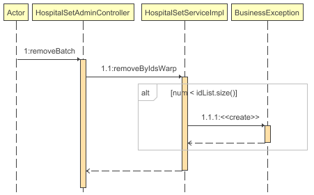

### 4.3.5 通过ID获取医院设置
- 接口路径：GET /admin/hospital/set/id/{id}
- 接口描述：根据传入的ID（最小值为1）获取对应的医院设置信息。
- 序列图：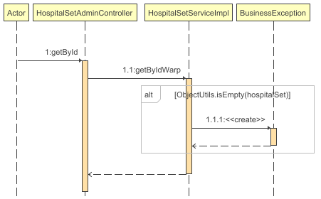

### 4.3.6 条件查询医院设置带分页
- 接口路径：POST /admin/hospital/set/find
- 接口描述：接收一个非空的HospitalSetQueryVO对象作为查询条件，以及可选的当前页码（默认为1，最小值为1）和每页大小（默认为20，最小值为1），返回符合条件的医院设置分页列表。
- 序列图：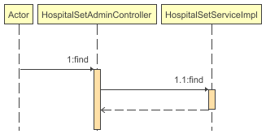

### 4.3.7 设置医院状态
- 接口路径：PUT /admin/hospital/set/status/{id}/{status}
- 接口描述：根据传入的医院ID（最小值为1）和状态（0或1）更新医院状态，成功更新则返回true。
- 序列图：

### 4.3.8 医院数据统计
- 接口路径：POST /admin/hospital/set/inner/statistic
- 接口描述：接收一个非空的HospitalStatisticVO对象，根据其中的参数进行医院数据统计计算，返回统计结果。
- 序列图：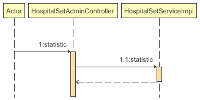

### 4.3.9 医院申请加入
- 接口路径：POST /api/hospital/side/join
- 接口描述：接收一个经过验证的HospitalJoinVO对象作为医院申请加入的信息，成功申请后返回一个包含密钥的资源实体(Resource)，该资源将以附件形式下载，文件名格式为'hospitalCode.key'。
- 序列图：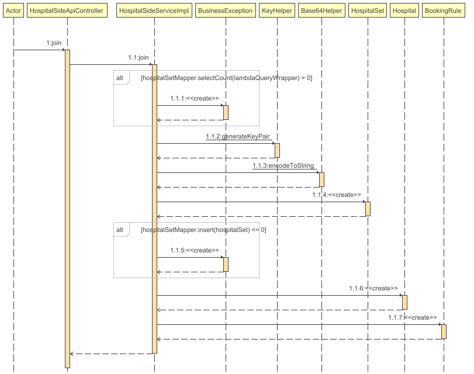

### 4.3.10 更新对称加密密钥
- 接口路径：GET /api/hospital/side/key/{hospitalCode}
- 接口描述：根据传入的医院编码更新该医院的对称加密密钥，成功更新后返回新密钥字符串。
- 序列图：

### 4.3.11 更新医院信息
- 接口路径：POST /api/hospital/side/hospital
- 接口描述：接收一个非空的EncryptionRequest对象，其中包含加密过的医院信息更新请求，成功更新后返回处理结果字符串。
- 序列图：

### 4.3.12 更新科室信息
- 接口路径：POST /api/hospital/side/department
- 接口描述：接收一个非空的EncryptionRequest对象，其中包含加密过的科室信息更新请求，成功更新后返回处理结果字符串。
- 序列图：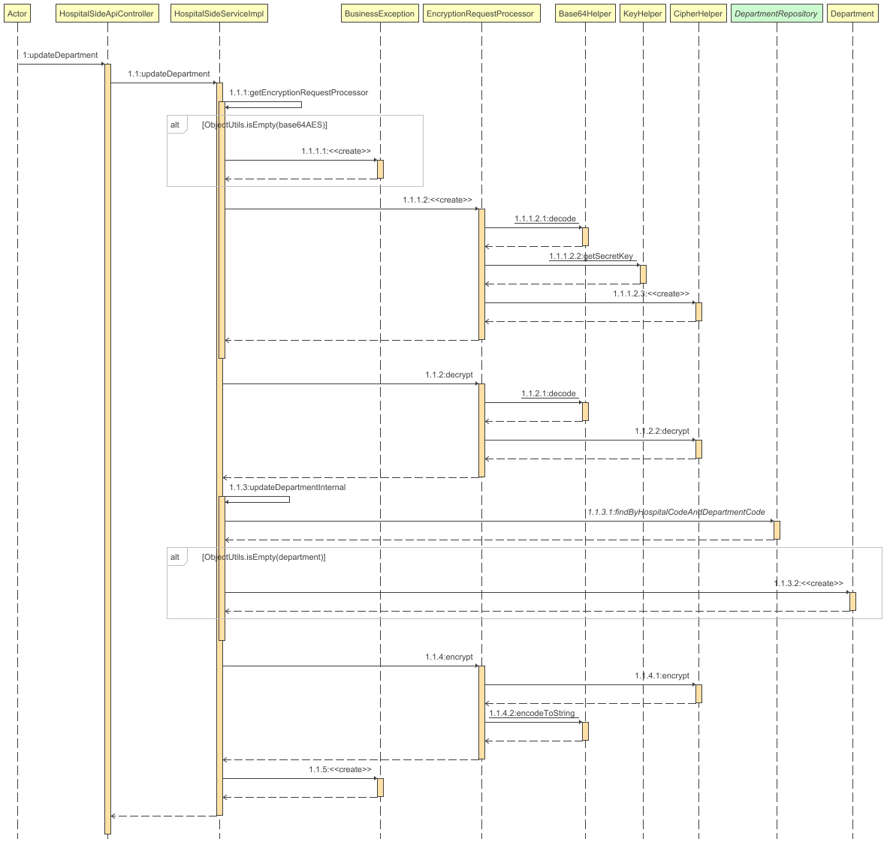

### 4.3.13 更新排班信息
- 接口路径：POST /api/hospital/side/schedule
- 接口描述：接收一个非空的EncryptionRequest对象，其中包含加密过的排班信息更新请求，成功更新后返回处理结果字符串。
- 序列图：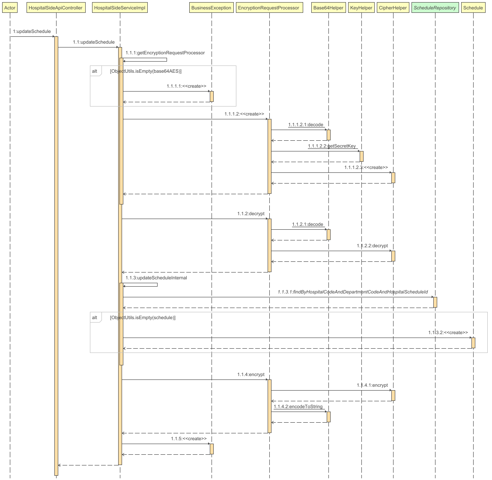

### 4.3.14 删除科室信息
- 接口路径：POST /api/hospital/side/remove/department
- 接口描述：接收一个非空的EncryptionRequest对象，其中包含加密过的科室信息删除请求，成功删除后返回处理结果字符串。
- 序列图：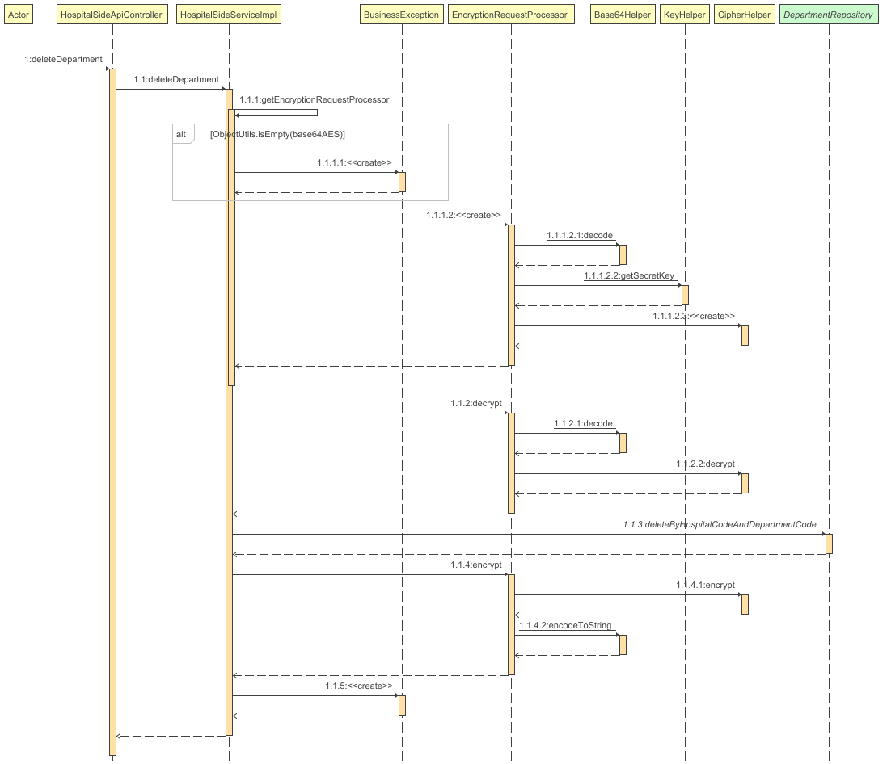

### 4.3.15 删除排班信息
- 接口路径：POST /api/hospital/side/remove/schedule
- 接口描述：接收一个非空的EncryptionRequest对象，其中包含加密过的排班信息删除请求，成功删除后返回处理结果字符串。
- 序列图：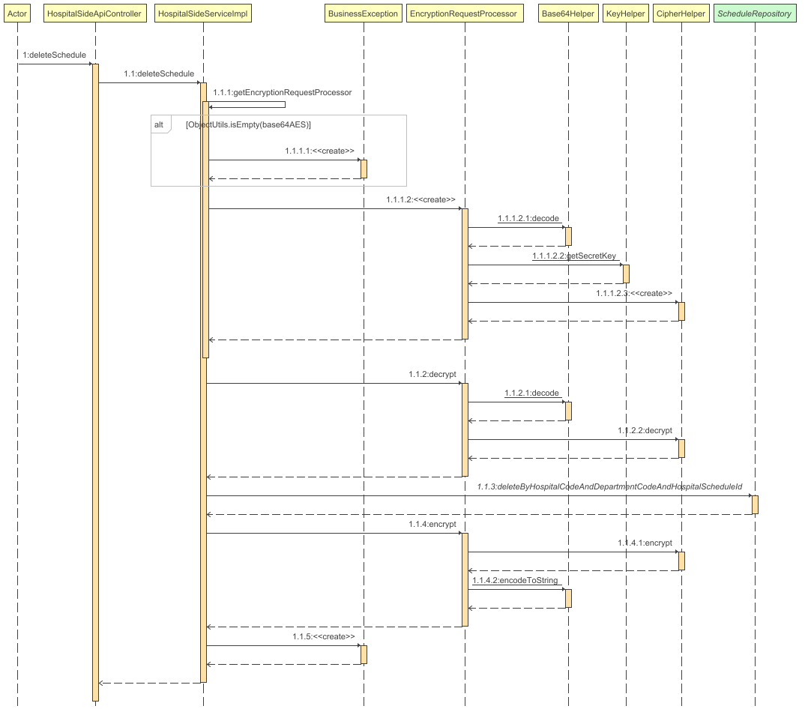

### 4.3.16 批量更新科室信息
- 接口路径：POST /api/hospital/side/departments
- 接口描述：接收一个非空的EncryptionRequest对象，其中包含加密过的批量科室信息更新请求，成功更新后返回处理结果字符串。
- 序列图：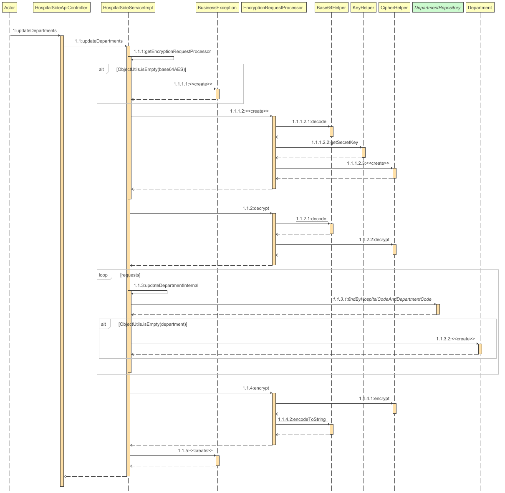

### 4.3.17 批量更新排班信息
- 接口路径：POST /api/hospital/side/schedules
- 接口描述：接收一个非空的EncryptionRequest对象，其中包含加密过的批量排班信息更新请求，成功更新后返回处理结果字符串。
- 序列图：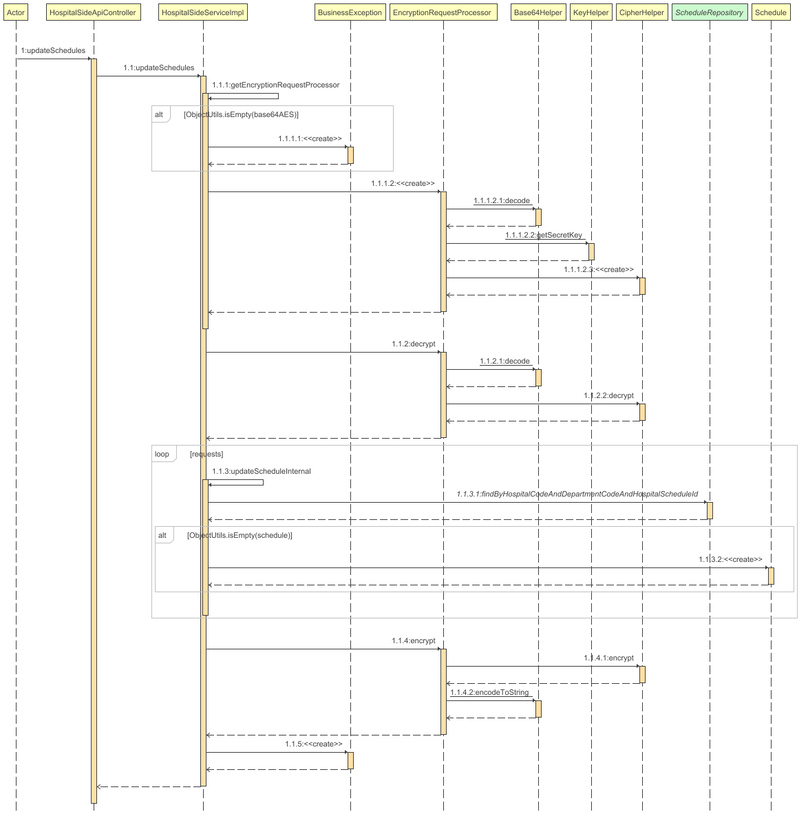

### 4.3.18 批量删除科室信息
- 接口路径：POST /api/hospital/side/remove/departments
- 接口描述：接收一个非空的EncryptionRequest对象，其中包含加密过的批量科室信息删除请求，成功删除后返回处理结果字符串。
- 序列图：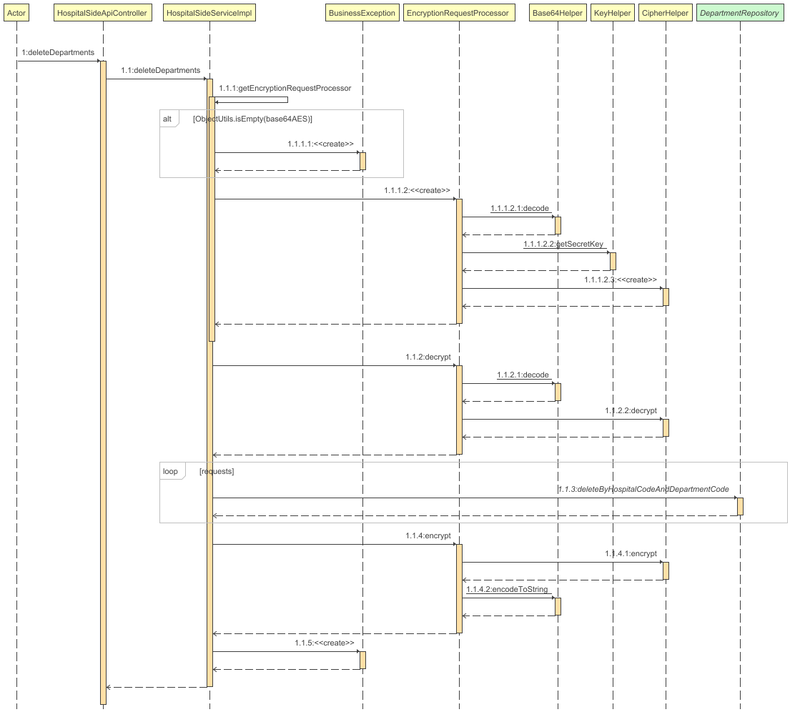

### 4.3.19 批量删除排班信息
- 接口路径：POST /api/hospital/side/remove/schedules
- 接口描述：接收一个非空的EncryptionRequest对象，其中包含加密过的批量排班信息删除请求，成功删除后返回处理结果字符串。
- 序列图：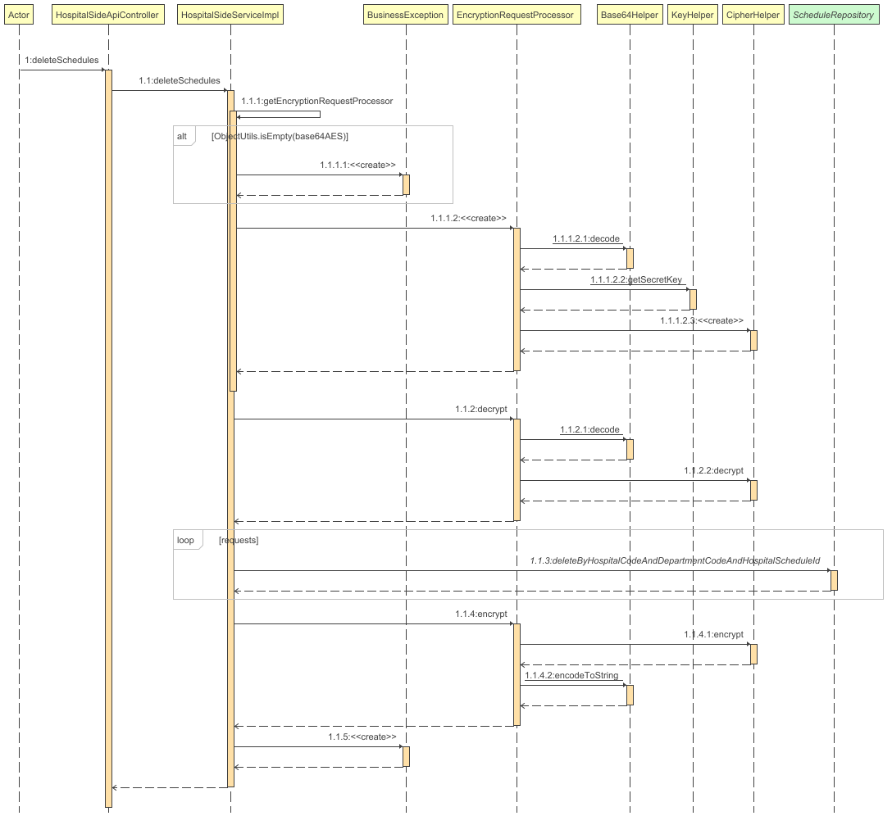

### 4.3.20 提交订单
- 接口路径：POST /api/hospital/side/order
- 接口描述：接收一个非空的OrderInfo对象作为订单提交信息，成功提交后返回true。
- 序列图：

### 4.3.21 更新订单
- 接口路径：POST /api/hospital/side/order/status
- 接口描述：接收一个非空的OrderInfo对象作为订单状态更新信息，成功更新后返回true。
- 序列图：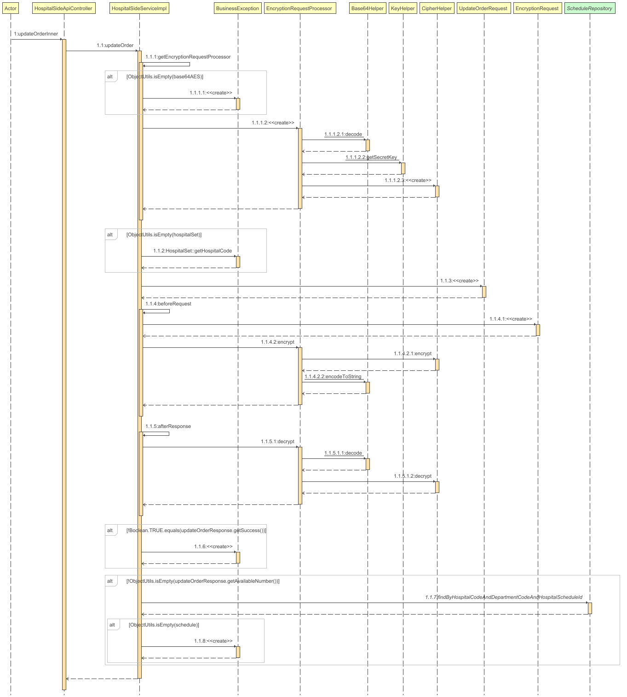

### 4.3.22 通过医院名称获取医院列表
- 接口路径：GET /api/hospital/find/name
- 接口描述：根据输入的医院名称（不能为空白字符）搜索匹配的医院列表，返回HospitalVO对象列表。
- 序列图：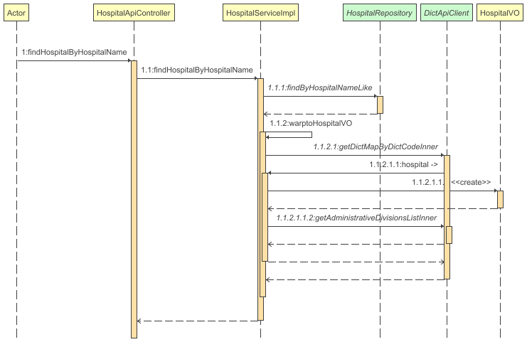

### 4.3.23 通过医院编码获取医院
- 接口路径：GET /api/hospital/find/code/{hospitalCode}
- 接口描述：根据提供的医院编码（不能为空白字符）获取对应医院的详细信息，返回HospitalVO对象。
- 序列图：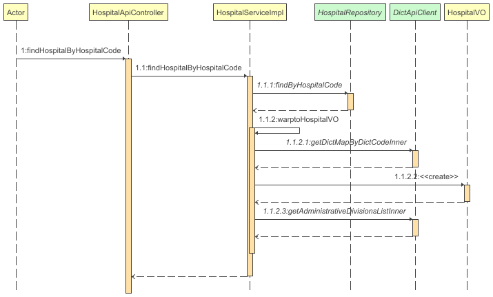

### 4.3.24 条件查询医院带分页
- 接口路径：POST /api/hospital/find/page
- 接口描述：接收一个非空的HospitalQueryVO对象作为查询条件，以及可选的当前页码（默认为1，最小值为1）和每页大小（默认为10，最小值为1），返回按条件分页查询的医院列表，封装在IPage<HospitalVO>对象中。
- 序列图：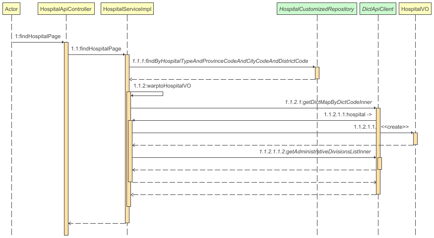

### 4.3.25 通过医院编码获取预约规则
- 接口路径：GET /api/hospital/find/rule/{hospitalCode}
- 接口描述：根据提供的医院编码（不能为空白字符）获取该医院的预约规则，返回BookingRule对象。
- 序列图：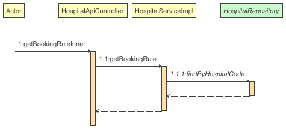

### 4.3.26 通过医院编码获取科室列表
- 接口路径：GET /api/hospital/department/hospital/code/{hospitalCode}
- 接口描述：根据传入的医院编码（不能为空白字符）获取该医院下的所有科室列表信息，返回的是DepartmentVO对象列表。
- 序列图：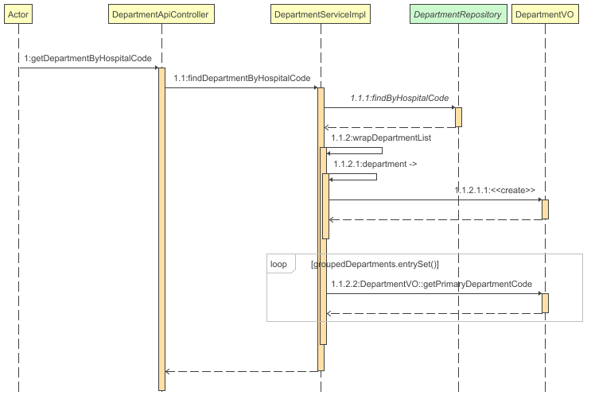

### 4.3.27 通过医院编码和科室编码获取科室
- 接口路径：GET /api/hospital/department/hospital/department/code
- 接口描述：根据输入的医院编码（不能为空白字符）和科室编码（同样不能为空白字符）获取特定医院下的特定科室信息，返回的是Department对象。
- 序列图：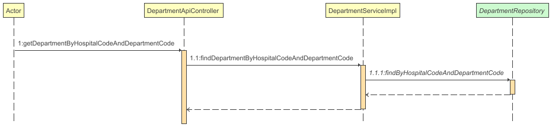

### 4.3.28 通过医院编码和科室编码获取排班列表
- 接口路径：GET /api/hospital/schedule/hospital/department/code
- 接口描述：根据提供的医院编码（不能为空白字符）和科室编码（不能为空白字符），获取该医院和科室下所有的排班信息，返回Schedule对象列表。
- 序列图：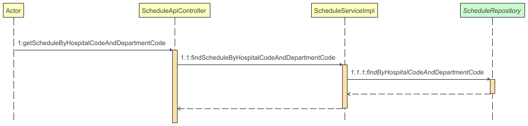

### 4.3.29 分页查询指定医院和科室的排班信息
- 接口路径：GET /api/hospital/schedule/page
- 接口描述：根据提供的医院编码（不能为空白字符）、科室编码（不能为空白字符），以及可选的当前页码（默认为1，最小值为1）和每页大小（默认为7，最小值为1），返回分页后的排班信息列表，封装在IPage<ScheduleVO>对象中。
- 序列图：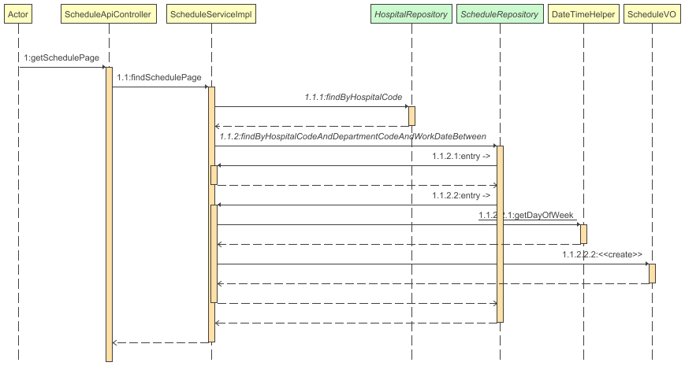

### 4.3.30 通过医院编码、科室编码和工作日期获取排班
- 接口路径：GET /api/hospital/schedule/hospital/department/date
- 接口描述：根据提供的医院编码（不能为空白字符）、科室编码（不能为空白字符）和工作日期（不能为空白字符），获取指定日期内该医院和科室的排班信息，返回Schedule对象列表。
- 序列图：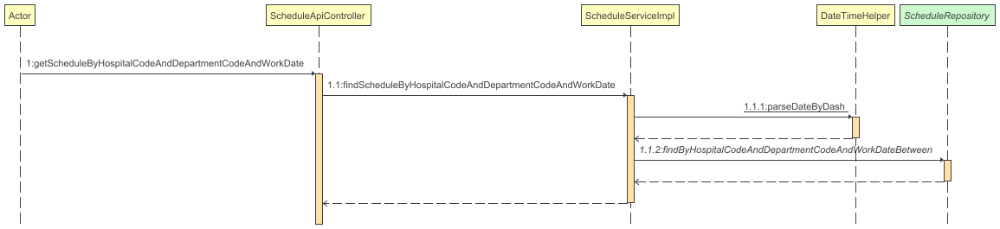

### 4.3.31 通过ID获取排班详情
- 接口路径：GET /api/hospital/schedule/id/{id}
- 接口描述：根据提供的排班ID（不能为空白字符），获取排班详情信息，返回ScheduleVO对象。
- 序列图：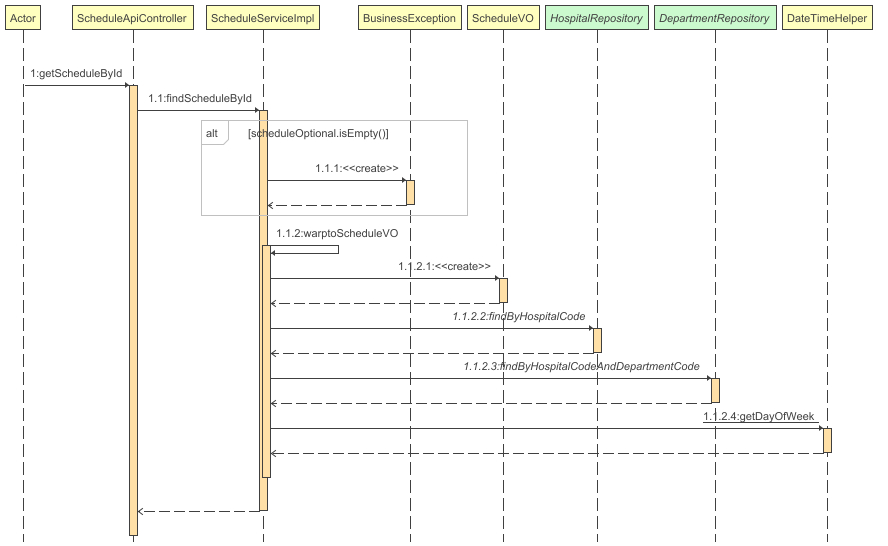

### 4.3.32 通过ID获取排班详情（内部调用）
- 接口路径：GET /api/hospital/schedule/inner/id/{id}
- 接口描述：内部使用的接口，根据提供的排班ID（不能为空白字符），获取排班详情信息，返回ScheduleVO对象。
- 序列图：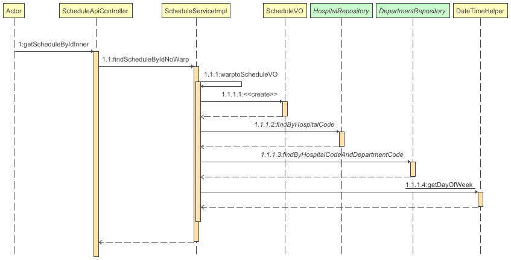

## 4.4 用户

### 4.4.1 新增用户
- 接口路径：POST /admin/user/info/save
- 接口描述：此接口用于接收并保存一个非空的UserInfo对象作为新的用户数据，成功保存到数据库后返回true。
- 序列图：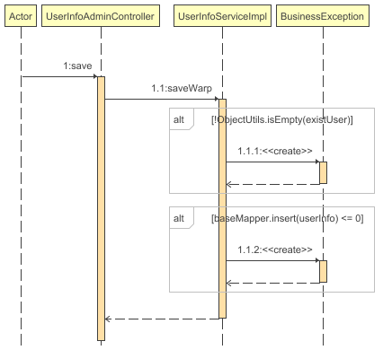

### 4.4.2 删除用户
- 接口路径：DELETE /admin/user/info/remove/id/{id}
- 接口描述：根据传入的用户ID（最小值为1）从数据库中删除对应用户，删除成功后返回true。
- 序列图：

### 4.4.3 批量删除用户
- 接口路径：DELETE /admin/user/info/remove/batch
- 接口描述：接收一个非空的用户ID列表，批量从数据库中删除指定的用户，删除成功后返回true。
- 序列图：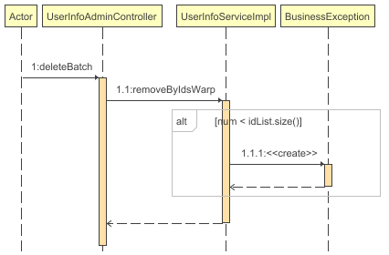

### 4.4.4 修改用户
- 接口路径：PUT /admin/user/info/update
- 接口描述：接收一个非空的UserInfo对象作为更新用户数据，根据其ID进行更新操作，成功更新到数据库后返回true。
- 序列图：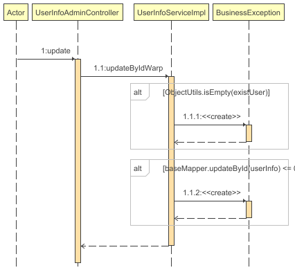

### 4.4.5 设置用户状态
- 接口路径：PUT /admin/user/info/status/{id}/{status}
- 接口描述：根据传入的用户ID（最小值为1）和状态（0或1）更新用户的启用禁用状态，成功更新到数据库后返回true。
- 序列图：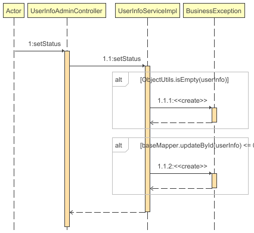

### 4.4.6 通过ID获取用户
- 接口路径：GET /admin/user/info/id/{id}
- 接口描述：根据传入的用户ID（最小值为1）从数据库中获取对应的用户信息。
- 序列图：

### 4.4.7 条件查询用户带分页
- 接口路径：POST /admin/user/info/find
- 接口描述：接收一个非空的UserInfoQueryVO对象作为查询条件，并指定当前页码（默认为1，最小值为1）和每页大小（默认为20，最小值为1），返回符合条件的用户信息分页列表。
- 序列图：

### 4.4.8 用户数据统计
- 接口路径：POST /admin/user/info/inner/statistic
- 接口描述：接收一个非空的UserStatisticVO对象作为统计条件，根据其中参数对用户数据进行统计计算，返回统计结果。
- 序列图：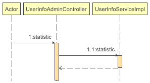

### 4.4.9 登录
- 接口路径：POST /api/user/info/login
- 接口描述：此接口接收一个非空的LoginParam对象作为登录凭证，其中包括用户名和密码等信息。接口验证登录信息有效后，返回一个包含用户身份标识和可能的访问令牌的LoginResponse对象。
- 序列图：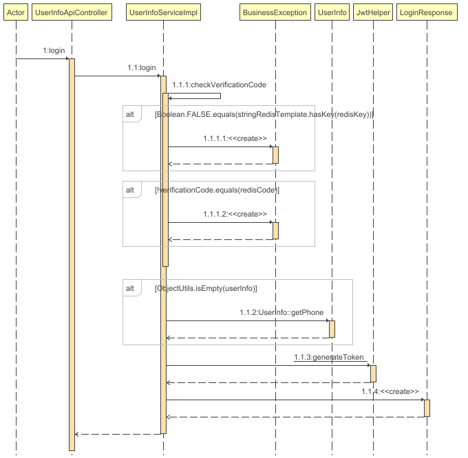

### 4.4.10 获取用户基本信息
- 接口路径：GET /api/user/info/auth/basic
- 接口描述：通过JWT鉴权传递用户ID，接口返回该用户的简要基本信息，如用户ID、昵称等，封装在UserInfoBasic对象中。
- 序列图：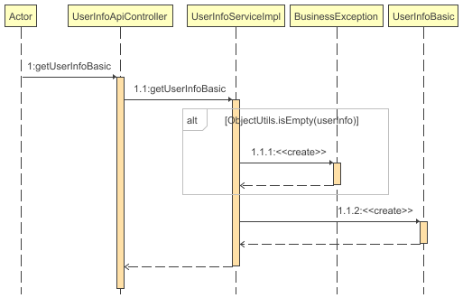

### 4.4.11 获取用户详细信息
- 接口路径：GET /api/user/info/auth/detail
- 接口描述：通过JWT鉴权传递用户ID，接口返回该用户的详细信息，包括但不限于基本信息、实名认证状态、联系方式等，封装在UserInfoVO对象中。
- 序列图：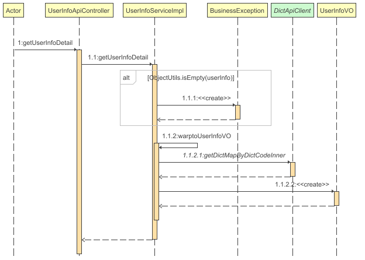

### 4.4.12 保存实名认证信息
- 接口路径：POST /api/user/info/auth/realname
- 接口描述：通过JWT鉴权传递用户ID，并接收一个非空的RealNameParam对象作为实名认证数据，接口将实名信息保存至用户账户中，成功保存后返回true。
- 序列图：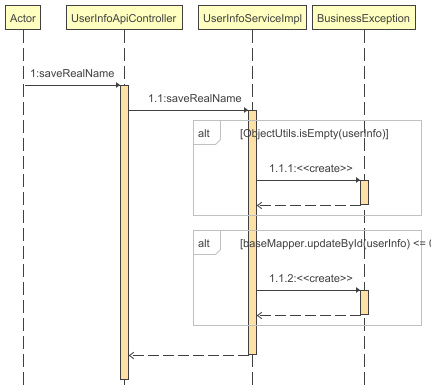

### 4.4.13 更新手机号
- 接口路径：POST /api/user/info/auth/phone
- 接口描述：通过JWT鉴权传递用户ID，并接收一个非空的LoginParam对象作为新的手机号信息，接口将更新用户的手机号码，成功更新后返回true。注意，这里的LoginParam应包含新的手机号码。
- 序列图：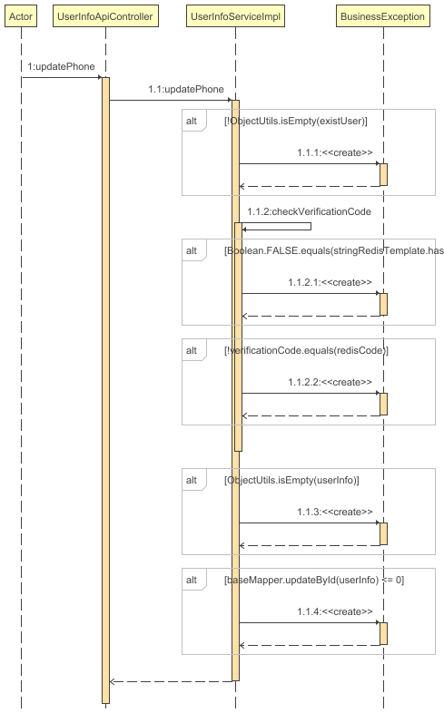

### 4.4.14 更新昵称
- 接口路径：POST /api/user/info/auth/nickname
- 接口描述：通过JWT鉴权传递用户ID，并通过请求参数指定新的昵称，接口将更新用户的昵称信息，成功更新后返回true。昵称不能为空。
- 序列图：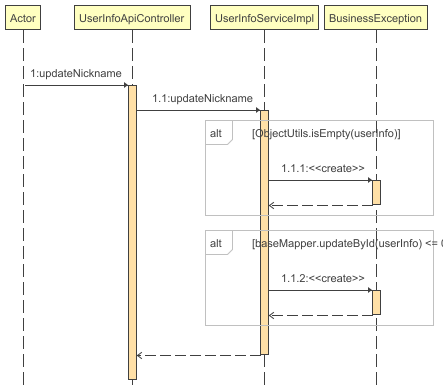

### 4.4.15 获取登陆二维码相关参数
- 接口路径：GET /api/user/wx/qrcode
- 接口描述：此接口用于获取微信开放平台登录二维码的相关参数，这些参数可用于生成微信扫码登录二维码。接口返回一个WxLoginQrCodeParam对象，其中包含了生成二维码所需的必要参数，如临时授权码、随机字符串和登录状态标识等。客户端利用返回的参数生成二维码，用户扫描后进入下一步登录流程。
- 序列图：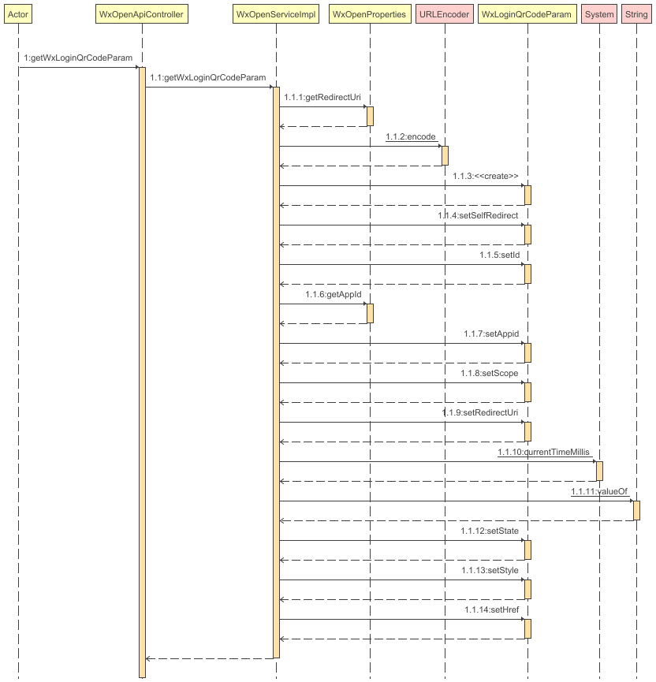

### 4.4.16 登录回调
- 接口路径：GET /api/user/wx/callback
- 接口描述：当用户在微信内扫描二维码并完成授权后，微信服务器将跳转至本接口，并携带code和state两个参数。接口接收到这两个参数后，通过wxOpenService处理登录回调逻辑，验证授权信息并完成用户登录流程。最终，该接口通常会返回一个重定向地址或者处理完登录后的相应信息。
- 序列图：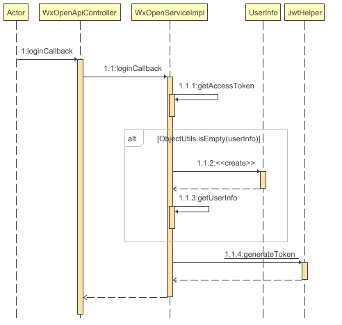

### 4.4.17 获取当前用户添加的所有就诊人
- 接口路径：GET /api/user/patient/auth/list
- 接口描述：此接口用于获取经过JWT鉴权的用户ID所关联的所有就诊人信息。接口成功执行后返回一个包含就诊人信息的列表。
- 序列图：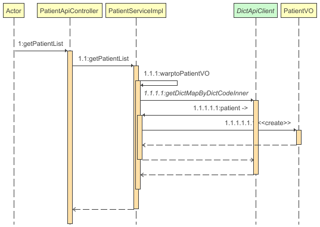

### 4.4.18 通过就诊人ID获取就诊人
- 接口路径：GET /api/user/patient/auth/detail/{patientId}
- 接口描述：通过JWT鉴权的用户ID和指定的就诊人ID获取就诊人的详细信息。成功获取后返回一个包含就诊人完整信息的对象。
- 序列图：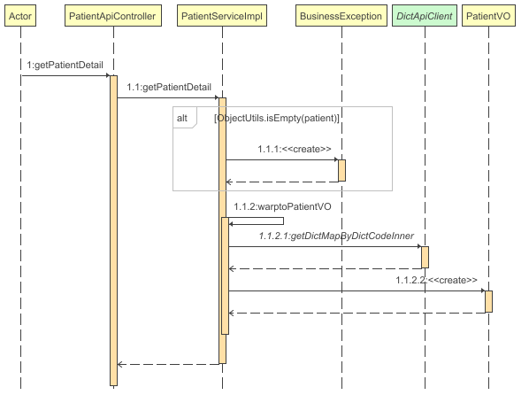

### 4.4.19 移除就诊人
- 接口路径：DELETE /api/user/patient/auth/remove/{patientId}
- 接口描述：根据JWT鉴权的用户ID和指定的就诊人ID，删除该用户关联的就诊人记录。删除成功后返回true。
- 序列图：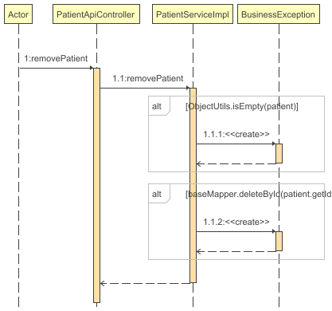

### 4.4.20 添加就诊人
- 接口路径：POST /api/user/patient/auth/add
- 接口描述：接收一个非空的Patient对象作为新增就诊人数据，同时通过JWT鉴权的用户ID确定所属关系，成功保存则返回true。
- 序列图：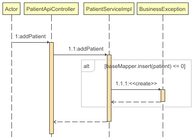

### 4.4.21 修改就诊人
- 接口路径：PUT /api/user/patient/auth/update
- 接口描述：接收一个非空的Patient对象作为更新就诊人数据，通过JWT鉴权的用户ID确认权限，根据患者ID进行更新操作，成功更新则返回true。
- 序列图：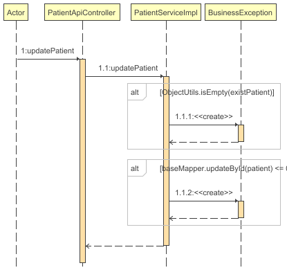

### 4.4.22 通过就诊人ID获取就诊人详情
- 接口路径：GET /api/user/patient/inner/detail/{patientId}
- 接口描述：此接口为内部使用，无需用户鉴权，直接通过就诊人ID获取就诊人的原始详细信息，成功获取后返回一个包含就诊人完整信息的对象。
- 序列图：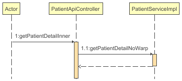

## 4.5 短信

### 4.5.1 发送验证码
- 接口路径：POST /api/sms/send/code/{phoneNumber}
- 接口描述：此接口用于向指定手机号发送验证码。通过HTTP POST请求，客户端需在路径参数中提供有效的手机号码，手机号格式必须符合中国大陆手机号码的正则表达式要求，即以1开头，第二位为3-9之间的数字，随后跟随9位数字。若手机号格式不正确，服务端将返回错误提示。调用该接口后，短信服务将会发送一条验证码短信至指定手机，接口返回一个布尔值，表示验证码发送操作是否成功。
- 序列图：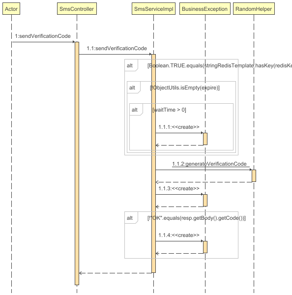

## 4.6 对象存储

### 4.6.1 获取OSS管理路径
- 接口路径：GET /admin/oss/file/path
- 接口描述：此接口用于获取对象存储服务（OSS）的管理路径，不涉及用户鉴权，直接返回存储系统的根或指定路径字符串。
- 序列图：

### 4.6.2 上传文件
- 接口路径：POST /admin/oss/file/upload
- 接口描述：用户通过HTTP POST方式上传单个文件，请求体需符合Multipart/form-data格式，并指定名为'file'的非空文件部分。接口成功执行后返回上传文件在系统内的唯一标识或者存储路径。
- 序列图：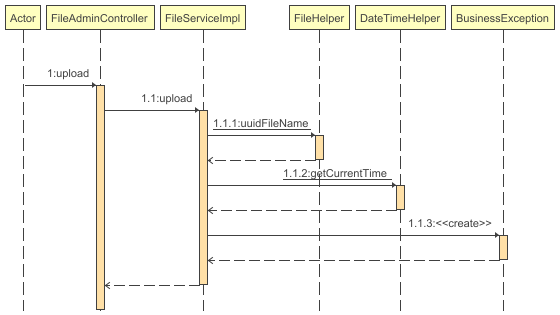

### 4.6.3 批量上传文件
- 接口路径：POST /admin/oss/file/upload/batch
- 接口描述：用户通过HTTP POST方式上传多个文件，请求体需符合Multipart/form-data格式，并指定名为'files'的非空文件数组。接口成功执行后返回一个包含每个已上传文件的唯一标识或存储路径的列表。
- 序列图：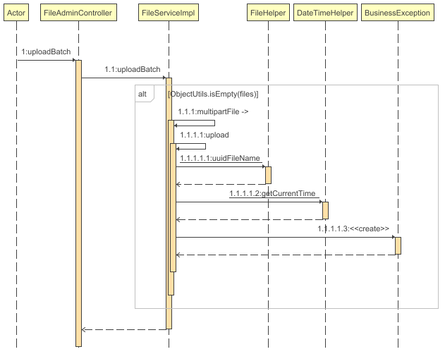

### 4.6.4 下载文件
- 接口路径：GET /admin/oss/file/download/{yyyy}/{MM}/{dd}/{uuidFileName}
- 接口描述：根据指定的年（yyyy）、月（MM）、日（dd）及UUID格式的文件名下载单个文件。接口根据给定的路径组合获取文件资源并返回一个包含文件内容的HTTP响应实体，可用于客户端直接下载。
- 序列图：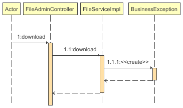

### 4.6.5 批量下载文件
- 接口路径：POST /admin/oss/file/download/batch
- 接口描述：用户通过请求体发送一个非空的文件URL列表，接口将这些文件打包成一个单一的下载资源（例如ZIP文件），并返回一个包含打包后文件内容的HTTP响应实体，以支持客户端一次性下载多个文件。
- 序列图：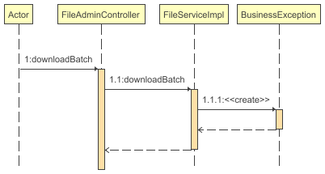

### 4.6.6 删除文件
- 接口路径：DELETE /admin/oss/file/delete/{yyyy}/{MM}/{dd}/{uuidFileName}
- 接口描述：根据指定的年（yyyy）、月（MM）、日（dd）及UUID格式的文件名删除单个文件。接口接收到合法的文件路径组合后，执行删除操作并返回一个布尔值，表示删除是否成功。
- 序列图：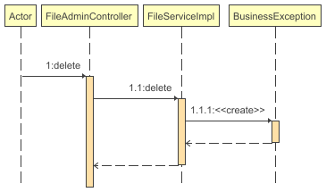

### 4.6.7 批量删除文件
- 接口路径：DELETE /admin/oss/file/delete/batch
- 接口描述：用户通过请求体发送一个非空的文件URL列表，接口依次删除列表中的所有文件，并返回一个布尔值，表示整个批量删除操作是否全部成功。
- 序列图：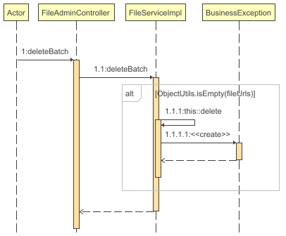

### 4.6.8 获取文件列表
- 接口路径：GET /admin/oss/file/list
- 接口描述：接口返回当前存储空间下符合特定条件的部分文件列表，支持分页加载。用户可以设置可选参数'continuationToken'进行分页查询，以及通过'maxKeys'参数控制每次请求返回的最大文件数量。接口最终返回一个包含文件列表信息的对象。
- 序列图：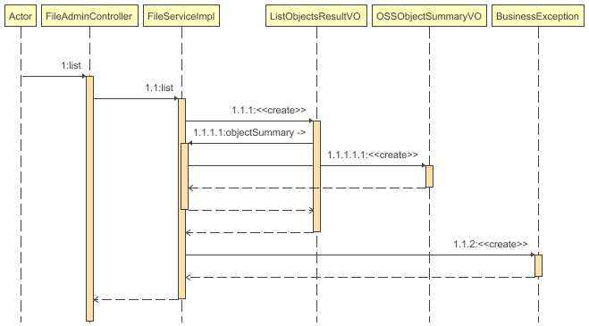

### 4.6.9 上传文件
- 接口路径：POST /api/oss/file/upload
- 接口描述：此接口接收一个HTTP POST请求，请求体类型为Multipart/form-data，其中包含一个名为'file'的非空文件部分。接口负责处理上传过程并将文件保存至服务器，成功上传后返回文件在系统内部的存储路径或其他唯一标识符。
- 序列图：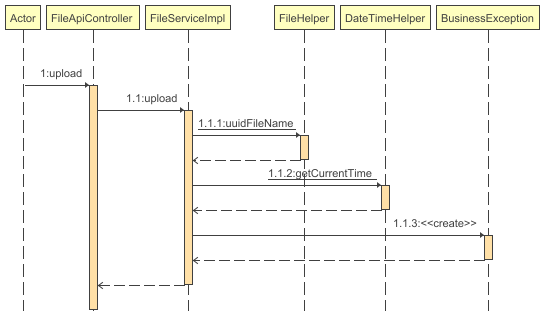

### 4.6.10 预览文件
- 接口路径：GET /api/oss/file/preview/{yyyy}/{MM}/{dd}/{uuidFileName}
- 接口描述：该接口用于在线预览存储在服务器上的文件。用户通过URL路径参数指定待预览文件的存储位置，包括年（yyyy）、月（MM）、日（dd）及UUID格式的文件名。接口从指定路径读取文件内容并将其转换为适合预览的格式（如图片或文档预览快照）。接口返回一个HTTP响应实体，其主体包含了预览文件的二进制数据，以便于前端展示预览效果。
- 序列图：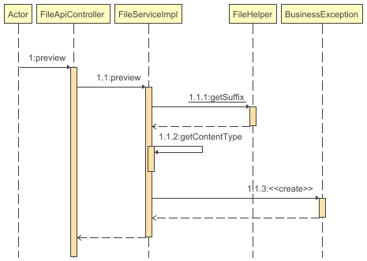

## 4.7 订单

### 4.7.1 新增订单
- 接口路径：POST /admin/order/info/save
- 接口描述：接收并保存一个完整的OrderInfo对象作为新的订单信息，成功保存则返回true。
- 序列图：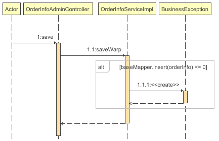

### 4.7.2 删除订单
- 接口路径：DELETE /admin/order/info/remove/id/{id}
- 接口描述：根据传入的订单ID（最小值为1）删除指定的订单，删除成功则返回true。
- 序列图：

### 4.7.3 批量删除订单
- 接口路径：DELETE /admin/order/info/remove/batch
- 接口描述：接收一个非空的Long类型的ID列表，批量删除指定的订单，删除成功则返回true。
- 序列图：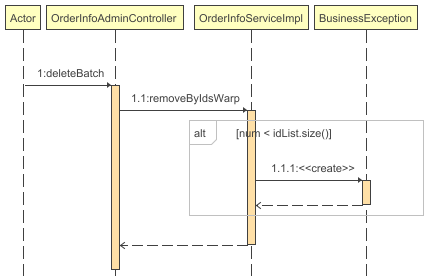

### 4.7.4 修改订单
- 接口路径：PUT /admin/order/info/update
- 接口描述：接收并更新一个完整的OrderInfo对象，根据其ID进行订单信息更新，成功更新则返回true。
- 序列图：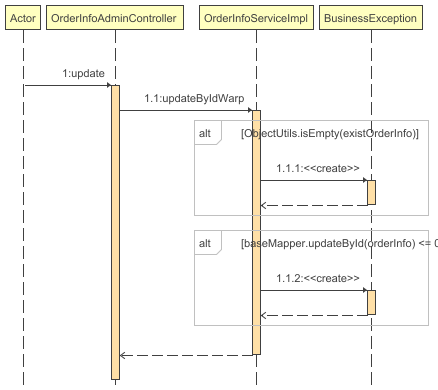

### 4.7.5 设置订单状态
- 接口路径：PUT /admin/order/info/status/{id}/{status}
- 接口描述：根据传入的订单ID（最小值为1）和状态值（-1至4之间的整数），更新订单状态，成功更新则返回true。
- 序列图：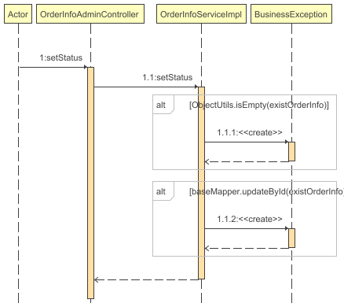

### 4.7.6 通过ID获取订单
- 接口路径：GET /admin/order/info/id/{id}
- 接口描述：根据传入的订单ID（最小值为1），获取指定订单的详细信息。
- 序列图：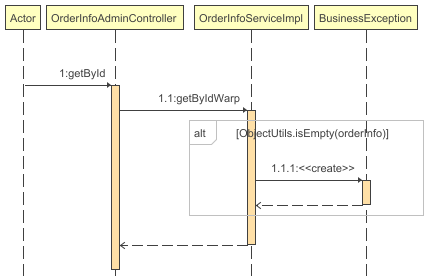

### 4.7.7 条件查询订单带分页
- 接口路径：POST /admin/order/info/find
- 接口描述：接收一个非空的OrderInfoQueryVO对象作为查询条件，以及可选的当前页码（默认为1，最小值为1）和每页大小（默认为20，最小值为1），返回符合查询条件的订单分页列表。
- 序列图：

### 4.7.8 订单数据统计
- 接口路径：POST /admin/order/info/inner/statistic
- 接口描述：接收一个非空的OrderStatisticVO对象，根据其中的参数进行订单数据统计计算，返回统计结果。
- 序列图：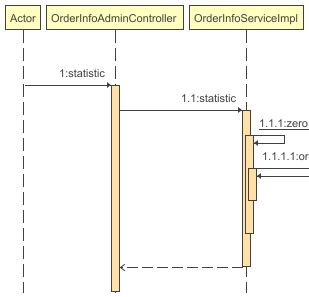

### 4.7.9 下单（生成订单）
- 接口路径：POST /api/order/info/auth/submit
- 接口描述：用户通过JWT鉴权传递用户ID，并在请求体中提交必填的SubmitOrderParam参数，完成下单流程并生成新订单，成功后返回新生成的订单ID。
- 序列图：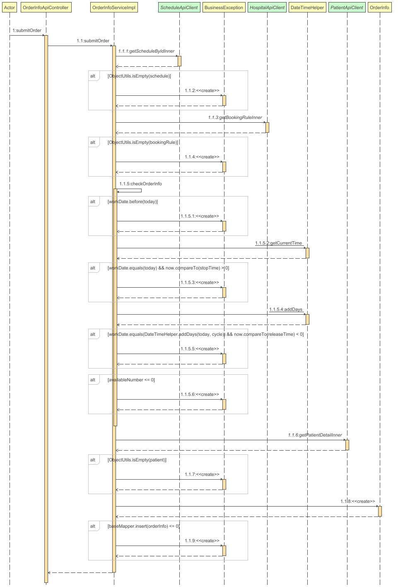

### 4.7.10 通过ID获取订单
- 接口路径：GET /api/order/info/auth/detail/{orderId}
- 接口描述：用户通过JWT鉴权传递用户ID，并在路径参数中指定订单ID，以获取该用户指定的订单详情信息。
- 序列图：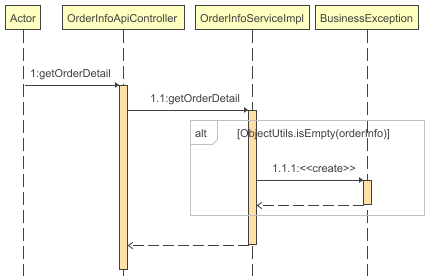

### 4.7.11 条件查询订单带分页
- 接口路径：POST /api/order/info/auth/list
- 接口描述：用户通过JWT鉴权传递用户ID，在请求体中提交非空的OrderInfoQueryParam对象作为查询条件，并指定当前页码（默认为1）和每页大小（默认为10），返回用户符合条件的订单列表分页结果。
- 序列图：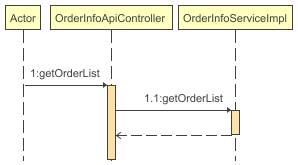

### 4.7.12 取消订单
- 接口路径：PUT /api/order/info/auth/cancel/{orderId}
- 接口描述：用户通过JWT鉴权传递用户ID，并在路径参数中指定要取消的订单ID，发起取消订单请求，成功取消后返回true。
- 序列图：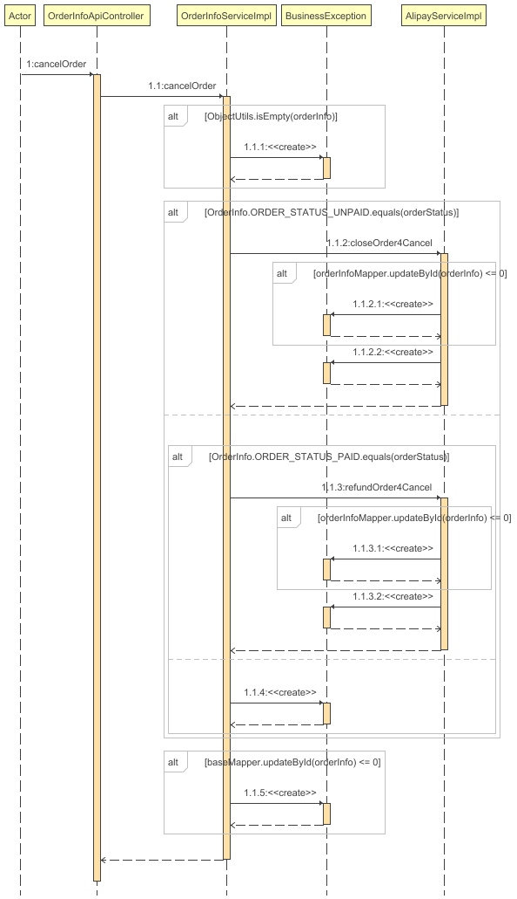

### 4.7.13 获取下单支付页面
- 接口路径：GET /api/order/alipay/auth/pay/{orderId}
- 接口描述：获取指定订单ID的支付页面URL，需要提供用户ID（通过请求头JwtHelper.X_USER_ID获取）。
- 序列图：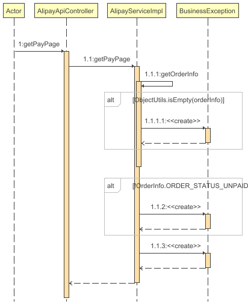

### 4.7.14 交易查询
- 接口路径：GET /api/order/alipay/auth/query/{orderId}
- 接口描述：根据用户ID（通过请求头JwtHelper.X_USER_ID获取）和订单ID查询交易状态，返回交易状态码。
- 序列图：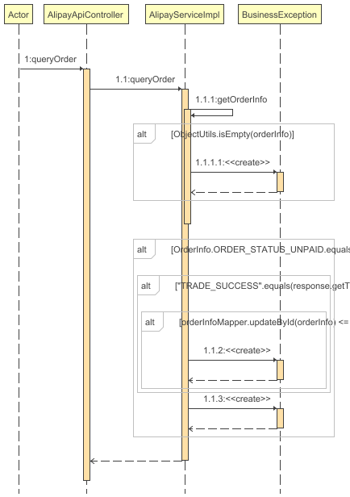

### 4.7.15 交易关闭
- 接口路径：PUT /api/order/alipay/auth/close/{orderId}
- 接口描述：根据用户ID（通过请求头JwtHelper.X_USER_ID获取）和订单ID关闭交易，返回操作结果状态码。
- 序列图：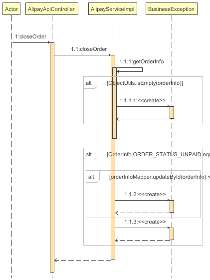

### 4.7.16 交易退款
- 接口路径：PUT /api/order/alipay/auth/refund/{orderId}
- 接口描述：根据用户ID（通过请求头JwtHelper.X_USER_ID获取）和订单ID发起退款操作，返回退款操作结果状态码。
- 序列图：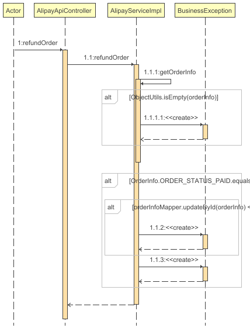

### 4.7.17 交易退款查询
- 接口路径：GET /api/order/alipay/auth/refund/query/{orderId}
- 接口描述：根据用户ID（通过请求头JwtHelper.X_USER_ID获取）和订单ID查询退款交易状态，返回退款交易状态码。
- 序列图：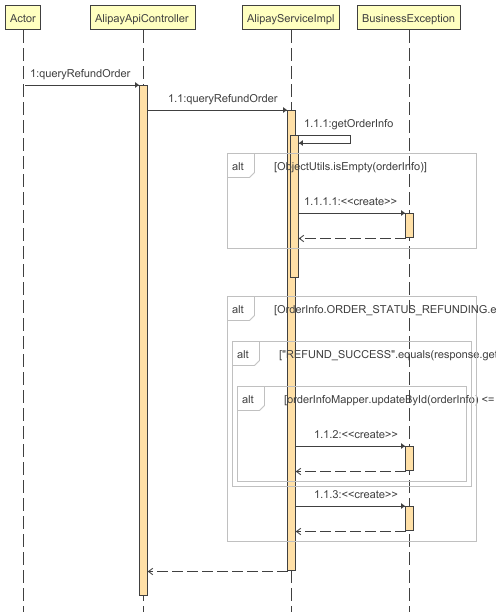

## 4.8 定时任务

### 4.8.1 发送就诊通知
- 接口路径：POST /admin/task/manual/visit/notification
- 接口描述：此接口用于手动触发发送就诊通知的定时任务。一旦调用此接口，服务端将立即执行发送就诊通知的任务逻辑，向待就诊患者发送相应的就诊提醒消息。
- 序列图：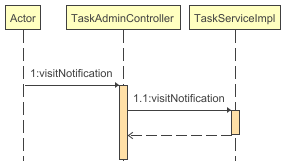

### 4.8.2 更新订单状态
- 接口路径：POST /admin/task/manual/update/order/status
- 接口描述：此接口用于手动触发更新订单状态的定时任务。当调用此接口时，服务端会立即执行该任务逻辑，根据预定的业务规则检查并更新系统中所有订单的状态，例如自动将即将到期的订单状态变更为待确认或其他状态。
- 序列图：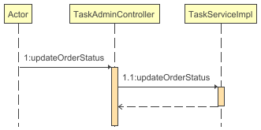

## 4.9 统计分析

### 4.9.1 医院统计
- 接口路径：POST /admin/statistics/analysis/hospital
- 接口描述：此接口用于对医院的相关数据进行统计分析。客户端需通过HTTP POST请求发送一个非空的HospitalStatisticVO对象，其中包含统计所需的筛选条件或指标定义。服务端接收到请求后，根据提供的参数执行相应的统计计算，然后返回一个包含医院统计数据的HospitalStatisticVO对象。
- 序列图：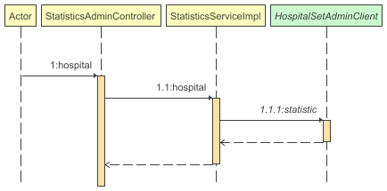

### 4.9.2 用户统计
- 接口路径：POST /admin/statistics/analysis/user
- 接口描述：此接口用于对用户数据进行统计分析。客户端通过HTTP POST方法提交一个非空的UserStatisticVO对象，其中包含了用户统计所需的具体参数。服务器端根据接收到的参数执行用户行为、活跃度或其他相关维度的统计计算，并返回一个包含用户统计数据的UserStatisticVO对象。
- 序列图：

### 4.9.3 订单统计
- 接口路径：POST /admin/statistics/analysis/order
- 接口描述：此接口提供了对订单数据进行统计的功能。客户端使用HTTP POST方法发送一个非空的OrderStatisticVO对象作为请求体，该对象中包含了订单统计的各项参数。服务端接收到请求后，根据请求体中的参数进行订单数量、金额、类别等多维度的统计分析，并返回一个包含订单统计数据的OrderStatisticVO对象。
- 序列图：

## 4.10 后台管理
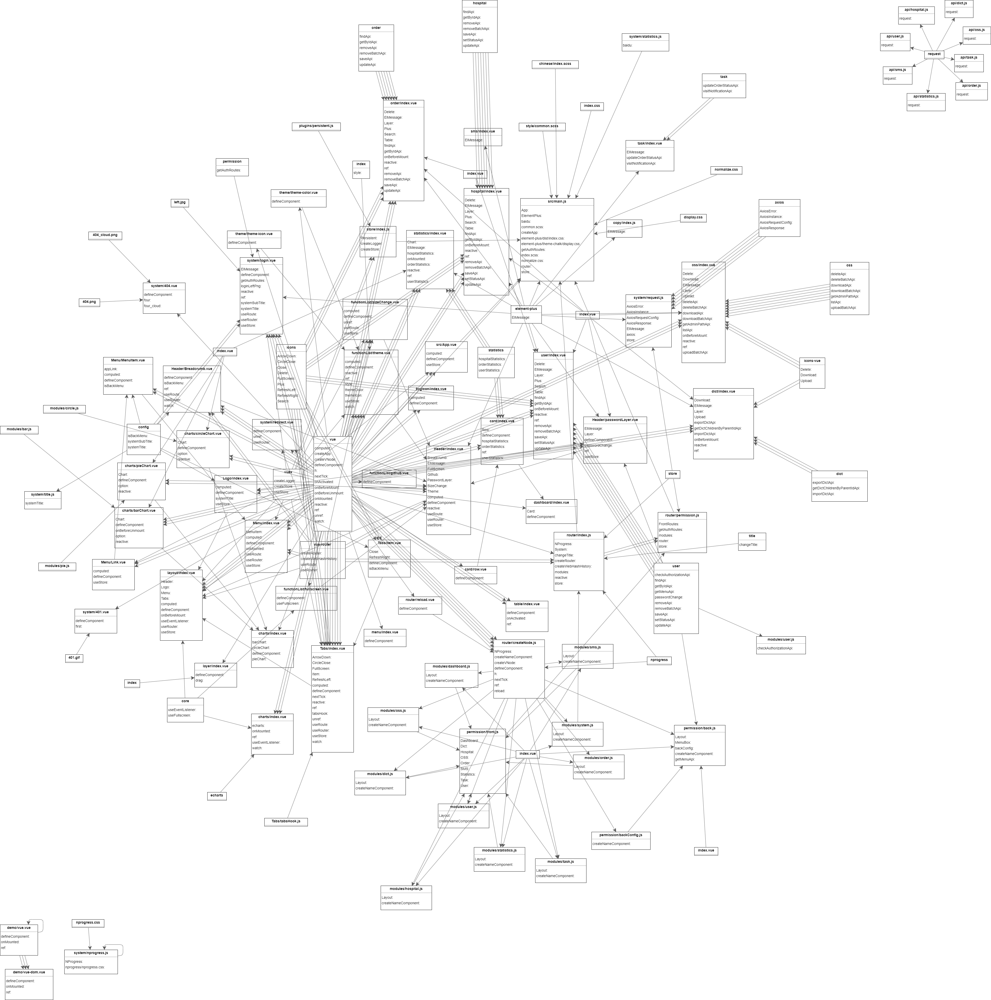

## 4.11 前台门户
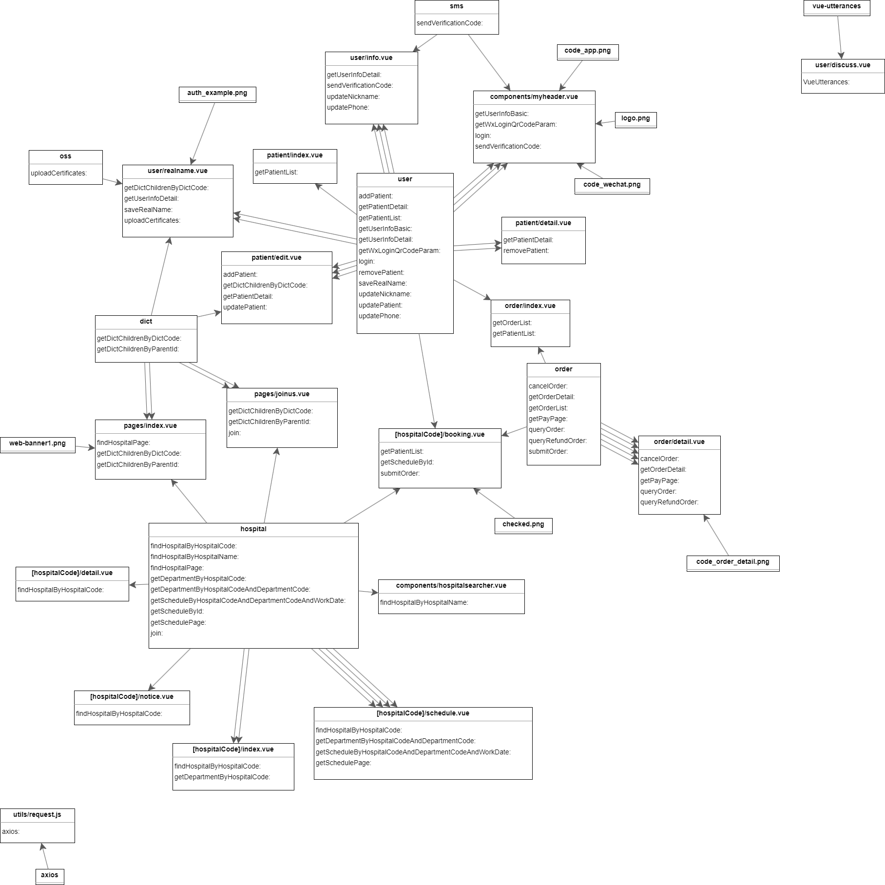
